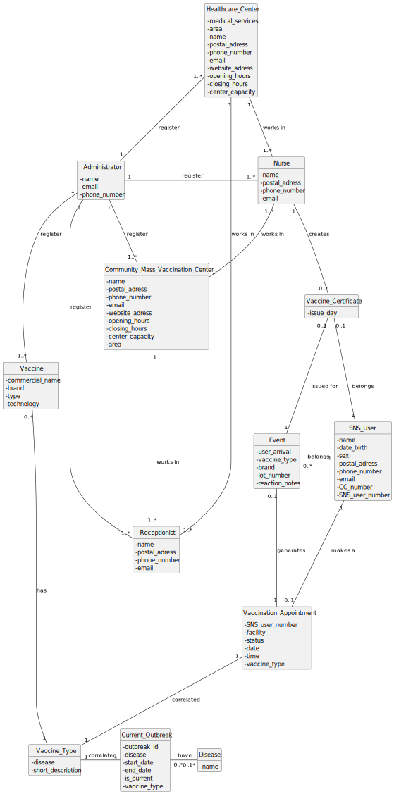

# OO Analysis

The construction process of the domain model is based on the client specifications, especially the nouns (for _concepts_) and verbs (for _relations_) used.

## Rationale to identify domain conceptual classes
To identify domain conceptual classes, start by making a list of candidate conceptual classes inspired by the list of categories suggested in the book "Applying UML and Patterns: An Introduction to Object-Oriented Analysis and Design and Iterative Development".

### _Conceptual Class Category List_

**Business Transactions**

- Appointment – pedido de marcação de vacinação efectuado por um utente.
- Vaccination Process – registo da administração de uma dose de vacina a um utente, incluindo observação e reacções adversas.

---

**Transaction Line Items**

- (Sem correspondência directa no domínio actual)

---

**Product/Service related to a Transaction or Transaction Line Item**

- Vaccine – produto biológico administrado para induzir imunidade.
- Vaccine Type – classificação geral (ARNm, proteína recombinante, vírus inactivado, etc.).
- Vaccine Brand – designação comercial e fabricante de uma vacina específica.

---

**Transaction Records**

- Vaccination Certificate – documento emitido após a conclusão do esquema vacinal.
- Vaccination History – conjunto de registos de vacinações de um utente.
- Adverse Reaction Record – registo de reacções adversas observadas.

---

**Roles of People or Organizations**

- SNS User – indivíduo com número de SNS que pode agendar e receber vacinas.
- Receptionist – funcionário que confirma presença e regista o estado do agendamento.
- Nurse – profissional que administra vacinas e regista o acto.
- DGS Administrator – elemento que gere centros, pessoal e configurações.

---

**Places**

- Vaccination Center – local de vacinação (centros fixos e temporários).

---

**Noteworthy Events**

- Appointment Created – quando um utente marca uma vacinação.
- Vaccination Performed – quando a vacina é administrada.
- Adverse Reaction Observed – quando é registada uma reacção adversa.

---

**Physical Objects**

- Vaccine Dose – unidade física administrada.

---

**Descriptions of Things**

- Vaccination Center – contém nome, morada, horário e capacidade máxima.
- Vaccine – código, doença-alvo, descrição, lote, validade.
- Vaccine Type – tecnologia (ARNm, subunidade proteica, etc.).
- Vaccine Brand – nome comercial e fabricante.
- User – nome, data de nascimento, sexo, morada, contacto e identificadores.
- Personnel – dados dos rececionistas e enfermeiros.
- Appointment – data, hora, centro e tipo de vacina.
- Vaccination Process – data, hora, tipo, marca, lote, observações.
- Vaccination Certificate – identifica utente, vacinas e datas.

---

**Catalogs**

- Vaccine Type Catalog – lista das várias tecnologias de vacinas aprovadas.
- Vaccine Brand Catalog – lista de marcas comerciais disponíveis.
- Vaccination Centers Catalog – lista de centros activos (fixos e temporários).

---

**Containers**

- User Registry – colecção de todos os utentes registados no sistema.
- Personnel Registry – lista de todos os funcionários (rececionistas e enfermeiros).
- Appointment Registry – lista de todos os agendamentos realizados.
- Vaccine Inventory – inventário de vacinas e respectivos lotes disponíveis em cada centro.

---

**Elements of Containers**

- (Sem elementos adicionais a identificar)

---

**(Other) Organizations**

- DGS – Direcção-Geral da Saúde.

---

**Other (External/Collaborating) Systems**

- SNS – Sistema Nacional de Saúde.
- Adverse Reaction Reporting Systems – sistemas externos de notificação.

---

**Records of finance, work, contracts, legal matters**

- (Não aplicável)

---

**Financial Instruments**

- (Não aplicável)

---

**Documents mentioned/used to perform some work**

- Vaccination Certificate – comprovativos emitidos após a vacinação.
- Adverse Reaction Report – documentos enviados para análise clínica.

---

## Rationale to identify associations between conceptual classes

An association is a relationship between instances of objects that indicates a relevant connection and that is worth of remembering, or it is derivable from the List of Common Associations:

- **_A_** is physically or logically part of **_B_**
- **_A_** is physically or logically contained in/on **_B_**
- **_A_** is a description for **_B_**
- **_A_** is known/logged/recorded/reported/captured in **_B_**
- **_A_** uses or manages or owns **_B_**
- **_A_** is related with a transaction (item) of **_B_**
- etc.

| Concept (A) | Association | Concept (B) |
|--------------|:------------:|-------------:|
| SNS User | schedules | Appointment |
| SNS User | owns | Vaccination History |
| SNS User | receives vaccination at | Vaccination Center |
| SNS User | obtains | Vaccination Certificate |
| Receptionist | manages | Appointment |
| Nurse | administers | Vaccine |
| Nurse | records | Vaccination Process |
| DGS Administrator | manages | Vaccination Center |
| DGS Administrator | manages | Personnel |
| DGS Administrator | manages | Vaccine Catalog |
| Vaccination Center | hosts | Personnel |
| Vaccination Center | stores | Vaccine |
| Vaccine | belongs to | Vaccine Type |
| Vaccine | produced by | Vaccine Brand |
| Appointment | scheduled at | Vaccination Center |
| Appointment | requests | Vaccine Type |
| Vaccination Process | refers to | Vaccine |
| Vaccination Process | reports | Adverse Reaction |

## Domain Model

**Do NOT forget to identify concept attributes too.**

