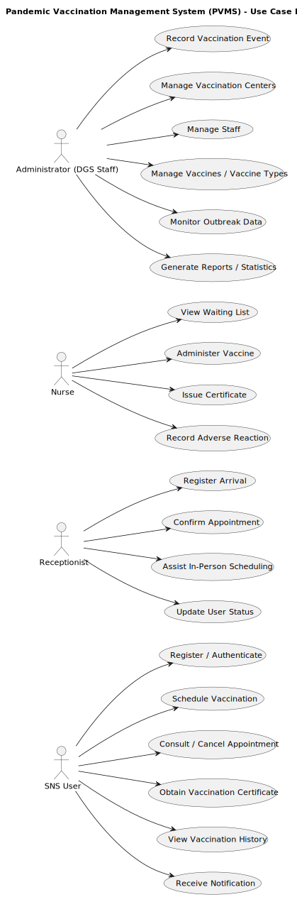

# Use Case Diagram (UCD)

**In the scope of this project, there is a direct relationship of _1 to 1_ between Use Cases (UC) and User Stories (US).**

However, be aware, this is a pedagogical simplification. On further projects and course units there may also exist _1 to N **and/or** N to 1_ relationships between UC and US.

By analyzing the problem statement, it is possible **to infer** the use cases depicted in the following diagram.

**It is worth noting that (some of) these UC were inferred. Therefore, it is important to validate its existence with the SW Client as well as in what each UC actually consists of.**

After receiving the User Stories of Sprint 2, the previous Use Case Diagram was updated in conformity as follows.

**For each UC/US, it must be provided evidences of applying main activities of the software development process (requirements, analysis, design, tests and code). Gather those evidences on a separate file for each UC/US and set up a link as suggested below.**

# Use Cases / User Stories
| UC/US  | Description                                 |                   
|:----|:--------------------------------------------|
| US01 | [Create a category](../US01/US01.md)           |
| US02 | [List all categories](../US02/US02.md)         |
| US03 | [Update category description](../US03/US03.md) |
| US04 | [Delete a category](../US04/US04.md)           |
| US05 | [Create a task](US05/US05.md)               |