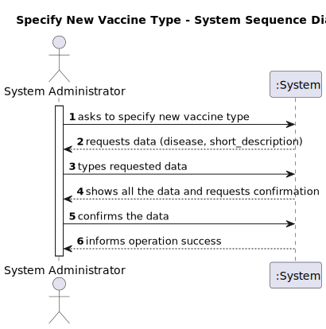
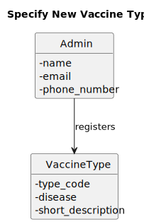
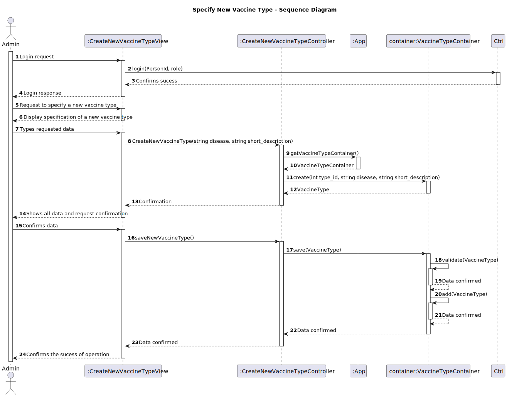
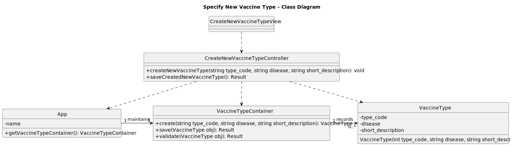

# US10 - Specify a new vaccine type

## 1. Requirements Engineering

### 1.1. User Story Description

- As Administrator, I want to specify a new vaccine type.

### 1.2. Customer Specifications and Clarifications

- The vaccine type code is manually defined by the administrator. 
- This code must be unique and consist of exactly 5 characters.
- This code can be considered the identifier (ID) of the vaccine type.

### 1.3. Acceptance Criteria

No additional details.

### 1.4. Found out Dependencies

- No dependecies.

### 1.5 Input and Output Data

**Input Data:**

- **Typed Data:**
  - code
  - disease
  - short_description
        

- **Selected Data:**
    - None.

**Output Data:**
- vaccine_type_ID?

### 1.6. System Sequence Diagram (SSD)

### 1.7. Other Relevant Remarks

- The new vaccine type can now be used in a vaccine specification.

---

## 2. OO Analysis

### 2.1. Relevant Domain Model Excerpt

### 2.2. Other Remarks

- n/a

---

## 3. Design - User Story Realization

### 3.1. Rationale

| Interaction ID | Question: Which class is responsible for...       | Answer                         | Justification (with patterns)                                                                                   |
|----------------|---------------------------------------------------|--------------------------------|-----------------------------------------------------------------------------------------------------------------|
| Step 1         | ... interacting with the actor?                   | CreateNewVaccineTypeView       | **Pure Fabrication**: There is no reason to assign this responsibility to any existing class in the Domain Model. |
|                | ... coordinating the user story?                  | CreateNewVaccineTypeController | **Controller**: Mediates between the view and the model.                                                        |
| Step 2         | ... requesting data?                              | CreateNewVaccineTypeView       | IE: is responsible for user interactions.                                                                       |
| Step 3         | ... types the requested data?                     | Admin                          | Creator (Rule 1): in the DM Admin registers vaccine type                                                        |
| Step 4         | ... showing all data and requesting confirmation? | CreateNewVaccineTypeView       | IE: is responsible for user interactions.                                                                       |
| Step 5         | .. instantiating a new vaccine type?              | Admin                          | Creator (Rule 1): in the DM Person registers Vaccine Type.                                                      |
| 			  		 | ... knowing the VaccineTypeContainer?             | Admin                          | IE: Admin knows the VaccineTypeContainer to which it is delegating some responsibilities.                       |
|                | ... validating all data?                          | VaccineTypeContainer           | IE: knows all its vaccine type.                                                                                 |
|                | ... saving the new vaccine type?                  | VaccineTypeContainer           | IE: owns all its vacccine type.                                                                                 |
| Step 6         | ... informing the operation sucess?               |  CreateNewVaccineTypeView                 | IE: is responsible for user interactions.                                                                       |

### Systematization

According to the taken rationale, the conceptual classes promoted to software classes are:

- VaccineType
- Admin

Other software classes (i.e., Pure Fabrication) identified:

- CreateNewVaccineTypeView
- CreateNewVaccineTypeController
- VaccineTypeContainer

### 3.2. Sequence Diagram (SD)

### 3.3. Class Diagram (CD)

