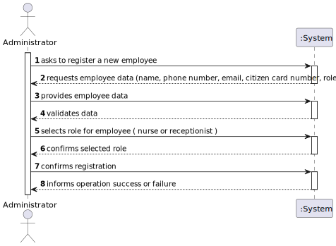
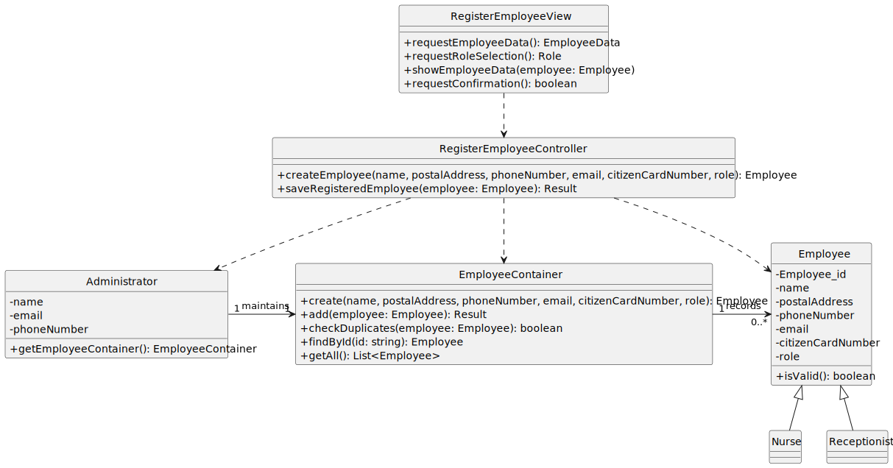

# US 14 - Register an Employee

## 1. Requirements Engineering

### 1.1. User Story Description

As an **Administrator**, I want to register an employee so that they can perform their role within the vaccination management system.

### 1.2. Customer Specifications and Clarifications

**From the specifications document:**

- Each employee must be assigned a single function/role within the system.
- The attributes **Name**, **Phone Number**, and **E-mail Address** are mandatory.
- The **Phone Number** and **Citizen Card Number** must comply with the Portuguese format.
- The **Phone Number** and **E-mail Address** must be unique across all registered employees.

**From the client clarifications:**

> **Question:** What roles can an employee have?  
> **Answer:** For now, there are two roles: **Nurse** and **Receptionist**.

> **Question:** Is it possible for the same person to have more than one role?  
> **Answer:** No. Each employee must have a single, unique role.

> **Question:** Who performs this registration?  
> **Answer:** Only an **Administrator** is allowed to register employees.

### 1.3. Acceptance Criteria

- **AC14-1:** Each employee must be assigned a single function/role within the system.
- **AC14-2:** The attributes Name, Phone Number, and E-mail Address are mandatory.
- **AC14-3:** The Phone Number and Citizen Card Number must comply with the Portuguese format.
- **AC14-4:** The Phone Number and E-mail Address must be unique across all registered employees.

### 1.4. Found out Dependencies

- Depends on the existence of an **Administrator** user.
- Depends on **Employee Role**  (Nurse, Receptionist) being registered in the system.

### 1.5. Input and Output Data

**Input Data:**

- Typed data:
    - Name
    - Postal Address
    - Phone Number
    - E-mail Address
    - Citizen Card Number
    - Role (selected from available roles)

**Output Data:**

- Confirmation of successful registration
- Error messages in case of duplicated or invalid data

### 1.6. System Sequence Diagram (SSD)

### 1.7. Other Relevant Remarks

- Only administrators can access the employee registration functionality.
- Validation rules must be applied before saving the employee record.

---

## 2. OO Analysis

### 2.1. Relevant Domain Model Excerpt

### 2.2. Other Remarks

- The `Administrator` entity maintains the list of employees.
- The `Employee` entity aggregates common attributes, while specific subtypes (`Nurse`, `Receptionist`) can extend it.

---

## 3. Design - User Story Realization

### 3.1. Rationale

| Interaction ID | Question: Which class is responsible for... | Answer | Justification (with patterns) |
|:----------------|:-------------------------------------------|:--------|:------------------------------|
| Step 1 | ... interacting with the actor? | `RegisterEmployeeView` | **Pure Fabrication** – there is no reason to assign this responsibility to any existing class in the Domain Model. |
| | ... coordinating the US? | `RegisterEmployeeController` | **Controller** – coordinates the system operation. |
| | ... knowing all existing employees? | `Administrator` | **IE** – maintains Employee (cf. DM). |
| |  | `EmployeeContainer` | **High Cohesion + Low Coupling** – `Administrator` delegates to `EmployeeContainer`. |
| | ... knowing the EmployeeContainer? | `Administrator` | **IE** – knows the container to which it delegates responsibilities. |
| | ... knowing each employee data? | `Employee` | **IE** – each Employee knows its own data. |
| Step 2 | ... obtaining employee data from the user? | `RegisterEmployeeView` | **IE** – responsible for user interactions. |
| Step 3 | ... validating and creating the new employee? | `RegisterEmployeeController` | **Controller** – responsible for coordinating validation and creation. |
| Step 4 | ... storing the new employee in the system? | `EmployeeContainer` | **IE** – maintains all employees. |
| Step 5 | ... informing operation success or failure? | `RegisterEmployeeView` | **IE** – responsible for user interactions. |

### Systematization

According to the taken rationale, the conceptual classes promoted to software classes are:

- `Administrator`
- `Employee`

Other software classes (Pure Fabrication) identified:

- `RegisterEmployeeView`
- `RegisterEmployeeController`
- `EmployeeContainer`

### 3.2. Sequence Diagram (SD)

### 3.3. Class Diagram (CD)

**Note:** Private attributes and/or methods were omitted.

---

## 4. Tests

Three relevant test scenarios are highlighted next.  
Other tests were also specified.

**Test 1:** Registering an employee with valid data.

    TEST_F(EmployeeContainerFixture, RegisterValidEmployee) {
    
        this->populateWithTwoEmployees();
    
        shared_ptr<Employee> obj = this->container->create(L"E003", L"John Doe", L"912345678", L"john.doe@email.com", L"12345678", L"Receptionist");
        EXPECT_TRUE(this->container->add(obj).isOK());
        EXPECT_EQ(this->container->count(), 3);
    }

**Test 2:** Trying to register an employee with a duplicate phone number.
        
    TEST_F(EmployeeContainerFixture, DuplicatePhoneNumber) {
        
            this->populateWithTwoEmployees();
        
            shared_ptr<Employee> obj = this->container->create(L"E004", L"Jane Smith", L"912345678", L"jane.smith@email.com", L"87654321", L"Nurse");
            EXPECT_FALSE(this->container->add(obj).isOK());
            EXPECT_EQ(this->container->count(), 2);
        }

**Test 3:** Trying to register an employee with invalid citizen card number format.

    TEST_F(EmployeeContainerFixture, InvalidCitizenCardFormat) {

    this->populateWithTwoEmployees();

    shared_ptr<Employee> obj = this->container->create(L"E005", L"Peter Costa", L"912111222", L"peter.costa@email.com", L"INVALID", L"Nurse");
    EXPECT_FALSE(this->container->add(obj).isOK());
    EXPECT_EQ(this->container->count(), 2);
}
## 5. Construction (Implementation)

- n/a
- 
## 6. Integration and Demo 
    int AdminMenuView::processMenuOption(int option) {
        int result = 0;
        BaseView * view;
        switch (option) {
            ...
            case 14:
                view = new RegisterEmployeeView(this->userToken);
                view->show();
            break;
        }
        return result;
    }

## 7. Observations 
- Only administrators can register employees.

- Validation rules must be centralized to maintain data integrity.

- The registration process ensures uniqueness of phone number and e-mail address.