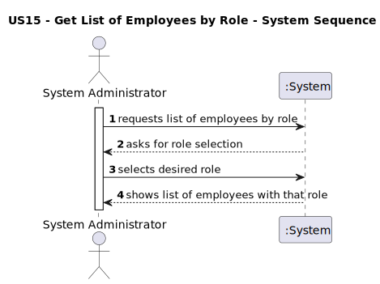
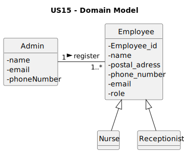
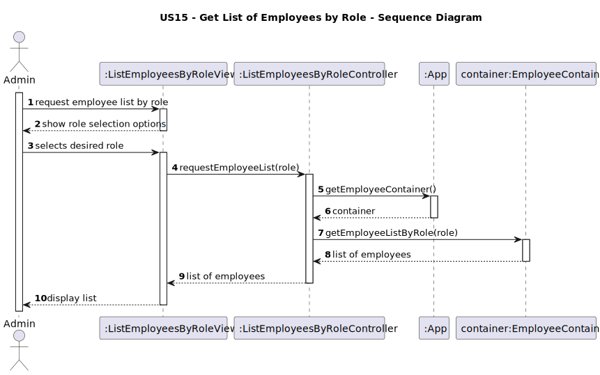
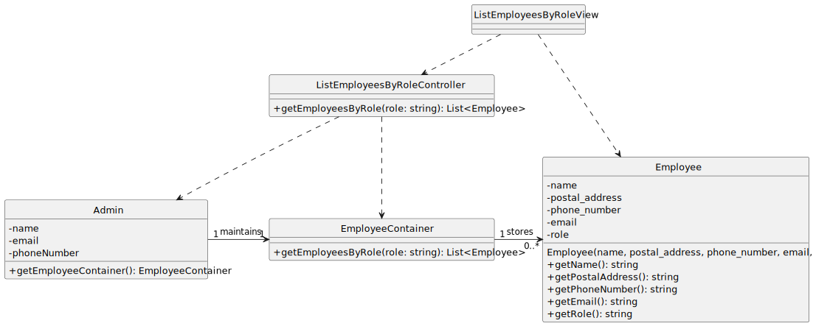

# US15 - List Employees by Role

---

## 1. Requirements Engineering

### 1.1. User Story Description

- As **Administrator**, I want to **list all employees by their role** so that I can easily manage and visualize staff by function.

---

### 1.2. Customer Specifications and Clarifications

**From the client clarifications:**

> **Question:** Which roles can the administrator list?  
> **Answer:** The system must allow listing employees registered under roles such as **Nurse**, **Receptionist**.

> **Question:** Is it possible to filter by more than one role at a time?  
> **Answer:** No. The listing is made for **only one role at a time**.

> **Question:** Can the administrator edit or remove employees in this functionality?  
> **Answer:** No. This user story only allows **viewing** the list of employees for a selected role.

---

### 1.3. Acceptance Criteria

- The administrator can select a role.
- The system displays all employees who have that role.
- If no employees exist for that role, the system shows an appropriate message.
- The list must display at least: **name, postal address, phone number, email, and role**.

---

### 1.4. Found out Dependencies

- No dependecies.

---

### 1.5. Input and Output Data

**Input Data:**

- **Selected Data:**
    - role (Nurse, Receptionist)

**Output Data:**
- List of employees (name, postal address, phone number, email, role)

---

### 1.6. System Sequence Diagram (SSD)

---

## 2. OO Analysis

### 2.1. Relevant Domain Model Excerpt

---

### 2.2. Other Remarks

- The administrator registers employees, which are later retrieved through this functionality.

---

## 3. Design - User Story Realization

### 3.1. Rationale

| Interaction ID | SSD Step Description                                                                 | Responsible Class                  | Justification (with patterns)                                                                                   |
|----------------|--------------------------------------------------------------------------------------|------------------------------------|------------------------------------------------------------------------------------------------------------------|
| Step 1         | Administrator requests the list of employees by role                                | ListEmployeesByRoleView            | **Pure Fabrication**: responsible for interacting with the actor.                                               |
| Step 2         | System asks for role selection                                                      | ListEmployeesByRoleView            | IE: responsible for displaying options to the administrator.                                                    |
| Step 3         | Administrator selects desired role                                                  | Admin                              | Actor initiating the use case; provides input to the system.                                                    |
| Step 4         | System retrieves employees with that role                                           | ListEmployeesByRoleController      | **Controller**: coordinates the request and delegates data retrieval.                                           |
| Step 5         | Controller requests employee list by role from the container                        | EmployeeContainer                  | **Information Expert**: knows and manages all employees and can filter them by role.                            |
| Step 6         | EmployeeContainer returns the list to the controller                                | EmployeeContainer / Controller     | **Low Coupling**: keeps data logic separated from coordination.                                                 |
| Step 7         | Controller sends list to the view                                                   | ListEmployeesByRoleController      | Responsible for delivering processed data to the view.                                                          |
| Step 8         | View displays the list of employees to the administrator                            | ListEmployeesByRoleView            | Responsible for presenting information to the actor.                                                            |

---

### Systematization

According to the rationale, the conceptual classes promoted to software classes are:

- **Employee**
- **Admin**

Other software classes (Pure Fabrication) identified:

- **ListEmployeesByRoleView**
- **ListEmployeesByRoleController**
- **EmployeeContainer**

---

### 3.2. Sequence Diagram (SD)

---

### 3.3. Class Diagram (CD)

---

