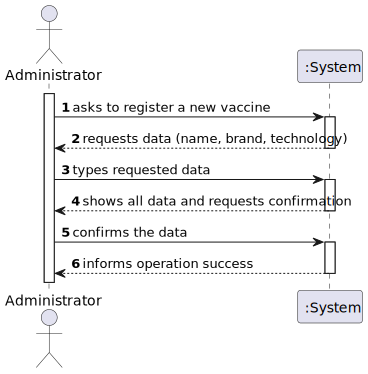
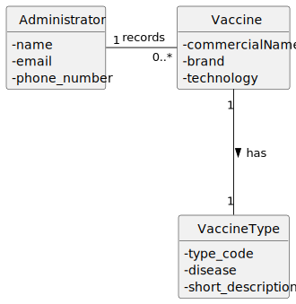

# US 11 - Register a vaccine

## 1. Requirements Engineering

### 1.1 User Story Description

As an **Administrator**, I want to **register a new vaccine** so that it becomes available to be scheduled and administered.

### 1.2 Customer Specifications and Clarifications

**From the Sprint 2 description:**

* AC11‑1: The vaccine technology must be selected from a predefined list of available types.  According to the reference suggested by the client (Pfizer’s article on vaccine technologies), these technologies are: **live‑attenuated**, **inactivated**, **subunit**, **toxoid**, **viral vector** and **mRNA**.

### 1.3 Acceptance Criteria

- **AC11-1:** The vaccine technology must be selected from the predefined list of technologies.
- **AC11-2:** The vaccine’s **commercial name** and **brand** must not be empty.
- **AC11-3:** A vaccine with the same commercial name and brand must not already exist in the system.

### 1.4 Found out Dependencies

- **US10** – Create a new vaccine type.  Vaccine registration depends on having at least one predefined vaccine type (with its technology).
- **Authentication** – Only users with the **Administrator** role can access this functionality.

### 1.5 Input and Output Data

**Input Data:**

- **Typed data:**
    - Commercial name (string).
    - Brand (string).
    - Technology (chosen from the predefined list: live‑attenuated, inactivated, subunit, toxoid, viral vector, mRNA).

- **Selected data:**
    - Vaccine type (optional), if the system allows choosing an existing type rather than only its technology.

**Output Data:**

- Operation success or failure (including validation messages).

### 1.6 System Sequence Diagram (SSD)

### 1.7 Other Relevant Remarks

- The predefined list of vaccine technologies should be loaded at system start (created in US10).  When registering a vaccine, the user chooses exactly one of those technologies.
- No persistence beyond in‑memory storage is required at this stage (Sprint 2 remark).

## 2. OO Analysis

### 2.1 Relevant Domain Model Excerpt

### 2.2 Other Remarks

- The **Administrator** is a specialization of the abstract User, with the responsibility of managing vaccine and employee registries.
- The **VaccineContainer** encapsulates the collection of all vaccines and applies validation rules (e.g. uniqueness, mandatory fields).  It is obtained through the Administrator object.

## 3. Design – User Story Realization

### 3.1 Rationale

| Interaction ID | Question: Which class is responsible for…                                   | Answer                          | Justification (with patterns)                                                                                                               |
|:--------------:|:----------------------------------------------------------------------------|:--------------------------------|:-------------------------------------------------------------------------------------------------------------------------------------------|
| Step&nbsp;1     | … interacting with the actor?                                               | RegisterVaccineView             | **Pure Fabrication / Information Expert (IE)**: No existing domain class represents the UI; a view class is created to handle user input. |
|                | … coordinating the user story?                                              | RegisterVaccineController       | **Controller**: Coordinates the flow between the view and the domain objects.                                                               |
| Step&nbsp;2     | … requesting the commercial name, brand and technology?                    | RegisterVaccineView             | **IE**: The view is responsible for interacting with the user and collecting input.                                                        |
| Step&nbsp;3     | … creating a new Vaccine object?                                            | VaccineContainer                | **Creator + High Cohesion / Low Coupling**: The container owns all vaccines; it is best suited to create a new instance.                 |
|                |                                                                              | DgsAdministrator                | **Creator + IE**: Administrator knows the VaccineContainer and can delegate creation to it.                                                |
| Step&nbsp;4     | … validating the vaccine’s data (mandatory fields, valid technology)?       | VaccineContainer                | **IE**: The container can validate new vaccines before adding them to its collection.                                                      |
| Step&nbsp;5     | … saving the vaccine in the system?                                         | VaccineContainer                | **IE**: Owns the collection of vaccines; responsible for adding the new vaccine if validation succeeds.                                     |
| Step&nbsp;6     | … informing operation success or failure?                                   | RegisterVaccineView             | **IE**: Responsible for user interaction and displaying results.                                                                             |

### 3.2 Sequence Diagram (SD)

### 3.3 Class Diagram (CD)

