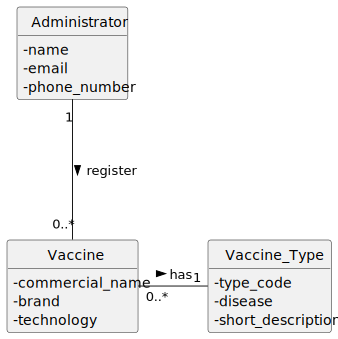
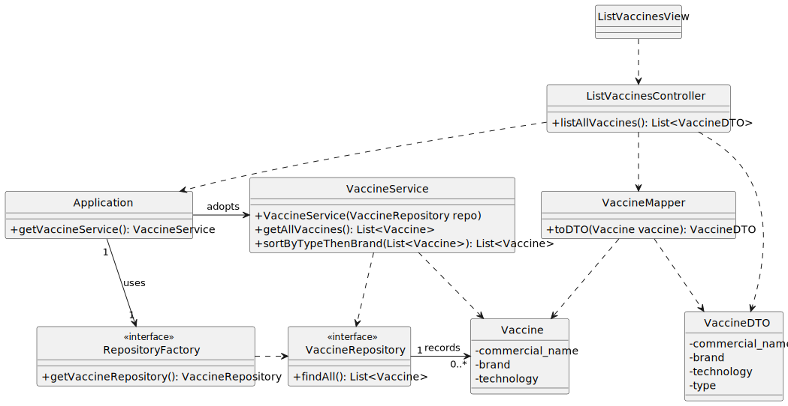

# US12 – To list all vaccines 

## 1. Requirements Engineering 

### 1.1. User Story Description

As an **Administrator**, I want to see a list of all existing vaccines.

---

### 1.2. Customer Specifications and Clarifications

**From the specifications document:**

> Administrators can register vaccines (US11).
> The system must allow retrieving the full set of registered vaccines.

**From the acceptance criteria:**

> **AC12-1:** The vaccines should be **grouped by vaccine type** and then **listed alphabetically by brand**.

**Additional clarifications derived from the project context:**

* A vaccine is associated with exactly one vaccine type.
* Only vaccines previously registered (US11) may appear in the listing.

---

### 1.3. Acceptance Criteria (AC) 

* **AC12-1:** Vaccines must be grouped by vaccine type.
* **AC12-2:** Within each group, vaccines must be listed in alphabetical order by brand.
* **AC12-3:** The system must not expose domain model entities directly to the UI.
* **AC12-4:** The returned data must use DTOs to ensure separation between UI and domain.

---

### 1.4. Found Out Dependencies

* **US11 – Register a Vaccine** (vaccines must exist before they can be listed).
* Vaccine Types must exist (US10).

---

### 1.5. Input and Output Data 

**Input Data:**

* n/a (no typed or selected input; this is a read-only operation)

**Output Data:**

* A list of vaccines grouped by vaccine type and sorted alphabetically by brand — represented as DTOs (`List<VaccineDTO>`).

---

### 1.6. System Sequence Diagram (SSD)

---

### 1.7. Other Relevant Remarks

* The introduction of **DTOs** is crucial to avoid exposing the internal domain structure (Vaccine, VaccineType) to the UI.
* **Sorting and grouping** (AC12-1, AC12-2) are responsibilities of the **application/service layer** (VaccineService), never the UI.

---
---

## 2. OO Analysis 

### 2.1. Relevant Domain Model Excerpt

### 2.2. Other Remarks

* The domain already provides the entities **Vaccine** and **Vaccine_Type**, which are needed for this US.
* The `VaccineService` (Pure Fabrication) will be introduced in the Design phase to manage the business rule (sorting/grouping).

---
---

## 3. Design – User Story Realization 

### 3.1. Rationale (GRASP)

| Interaction ID | Question: Which class is responsible for... | Answer | Justification (with patterns) |
| :---: | :--- | :--- | :--- |
| **Step 1** | **(Request) ... coordinating the list request and fetching the data?** | | |
| | ... interacting with the actor and initiating the use case? | ListVaccinesView | **Pure Fabrication / IE**: Mediates the request from the Administrator. |
| | ... coordinating the entire data retrieval and mapping flow? | ListVaccinesController | **Controller**: Orchestrates the use case (obtaining service, calling service, mapping). |
| | ... obtaining the necessary **VaccineService** instance? | Application | **Pure Fabrication / Factory**: Acts as a service locator. |
| | ... retrieving the list of all **Vaccine** domain objects? | VaccineService | **Pure Fabrication / Low Coupling**: Coordinates business logic and delegates persistence access. |
| | ... fetching the raw data from the data source? | VaccineRepository | **Repository**: Provides an abstraction layer for storage access. |
| | ... applying the **sorting and grouping rule (AC12-1, AC12-2)**? | VaccineService | **Information Expert**: The service layer holds the business logic related to the collection of domain objects. |
| **Step 2** | **(Response) ... mapping the result and displaying the list?** | | |
| | ... transforming **Vaccine** domain objects into **VaccineDTO**? | VaccineMapper | **Pure Fabrication**: Dedicated class for DTO conversion (AC12-3). |
| | ... carrying the result data back to the View? | VaccineDTO | **DTO**: Data Transfer Object, ensures separation and low coupling (AC12-4). |
| | ... displaying the result to the Administrator? | ListVaccinesView | **IE**: Responsible for formatting and presenting the final list to the actor. |
### Systematization

According to the rationale, the conceptual classes promoted to software classes are:

* `Vaccine`
* `Vaccine_Type`
* `Administrator`

Other software classes (Pure Fabrication) identified:

* `ListVaccinesView` (UI)
* `ListVaccinesController` (Controller)
* `Application` (Service Locator/Bootstrap)
* `RepositoryFactory` (Factory)
* `VaccineService` (Service Layer/Business Logic)
* `VaccineRepository` (Persistence Abstraction)
* `VaccineMapper` (DTO Conversion)
* `VaccineDTO` (Data Transfer Object)

**Important design practice:**
The `VaccineService` is responsible for applying the business rule (sorting/grouping), while the `ListVaccinesController` is responsible for orchestrating the overall flow, including mapping domain objects to DTOs using the `VaccineMapper`.

---

### 3.2. Sequence Diagram (SD)

### 3.3. Class Diagram (CD)

**Note:** Private attributes and/or methods were omitted in the diagram code.