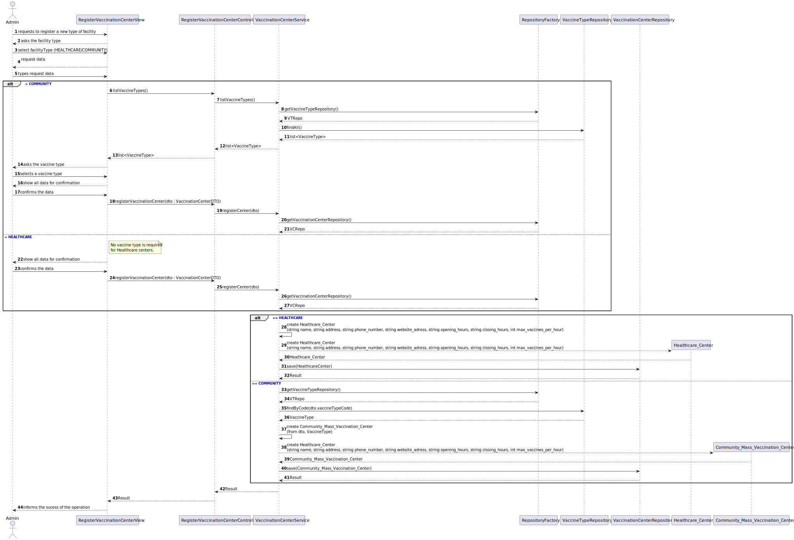
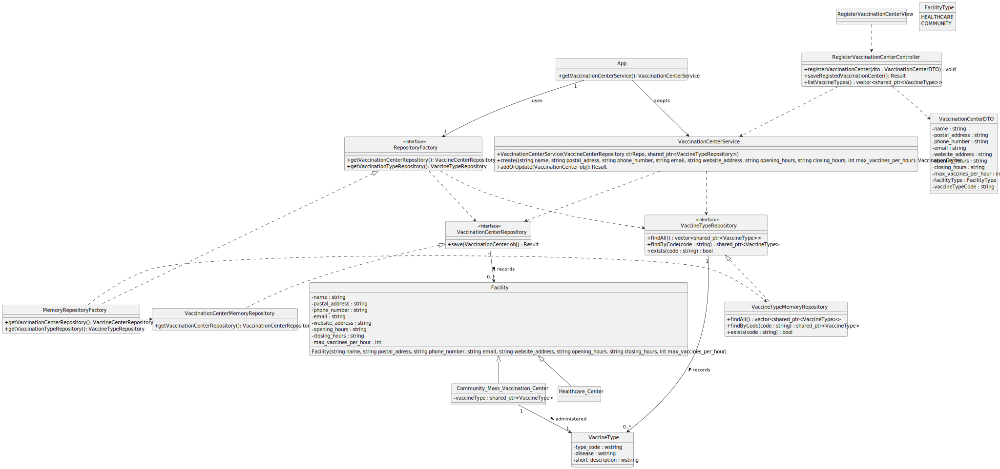

1# US10 - Specify a new vaccine type

## 1. Requirements Engineering

### 1.1. User Story Description

- As Administrator, I want to register a vaccination center.

### 1.2. Customer Specifications and Clarifications

### 1.3. Acceptance Criteria

- AC13-3: Community Mass Vaccination Centers must include the vaccine type administered.

### 1.4. Found out Dependencies

- The Community Mass Vaccination Center registration depends on having at least one existing vaccine type.

### 1.5 Input and Output Data

**Input Data:**

- **Typed Data:**
- name
  - postal_adress
  - phone_number
  - email
  - website_adress
  - opening_hours
  - closing_hours
  - max_vaccines_per_hour
        

- **Selected Data:**
    - Healthcare Center
    - Community Mass Vaccination Center

**Conditional Typed/Selected Data (Community Mass Vaccination Center):**

- Vaccine Type administered (selected — from existing Vaccine Types)

**Output Data:**
- None.

### 1.6. System Sequence Diagram (SSD)

### 1.7. Other Relevant Remarks

---

## 2. OO Analysis

### 2.1. Relevant Domain Model Excerpt

### 2.2. Other Remarks

- n/a

---

## 3. Design - User Story Realization

### 3.1. Rationale

- This rationale table follows the steps for the creation of a Facility with the type Mass Community Vaccination Center.

| Interaction ID | Question: Which class is responsible for...                              | Answer                               | Justification (with patterns)                                                                                     |
|---------------|--------------------------------------------------------------------------|--------------------------------------|-------------------------------------------------------------------------------------------------------------------|
| Step 1        | ... interacting with the actor?                                          | RegisterVaccinationCenterView        | **Pure Fabrication**: There is no reason to assign this responsibility to any existing class in the Domain Model. |
|               | ... coordinating the user story?                                         | RegisterVaccinationCenterController  | **Controller**: Mediates between the view and the model.                                                          |
| Step 2        | ... asking the facility type?                                            | RegisterVaccinationCenterView        | IE: is responsible for user interactions.                                                                         |
| Step 3        | ... selecting the facility type?                                         | Admin                                | Creator (Rule 1): in the DM Admin selects the desired facility type.                                              |
| Step 4        | ... requesting data?                                                     | RegisterVaccinationCenterView        | IE: is responsible for user interactions.                                                                         |
| Step 5        | .. typing the requested data?                                            | Admin                                | Creator (Rule 1): in the DM Admin registers the facility data.                                                    |
| Step 6		   	  | ... asking the vaccine type?                                             | RegisterVaccinationCenterView        | IE: is responsible for user interactions.                                                                         |
|               | ...requesting the vaccine type list?                                     | RegisterVaccinationCenterController  | **Controller** : Delegates to the service the retrieval of business-related data (vaccine types).                 |
|               | ...retrieving the list of existing vaccine types?                        | VaccinationCenterService             | IE: The service knows the business logic and must use the VaccineType repository.                                 |
|               | ...listing all available vaccine types stored in the system?             | VaccineTypeRepository                | **Information Expert**: The repository is responsible for accessing stored vaccine types.                         |
|               | ...encapsulating persistence details (memory/file/db)?                   | RepositoryFactory                    | **Protected Variations**: The factory hides which concrete repository is used; clients depend only on interfaces. |
| Step 7        | ... selecting the vaccine type?                                          | Admin                                | Creator (Rule 1): in the DM Person selects the vaccine type for the community mass vaccination center.            |
|               | ... building a structured object with all input data?                    | VaccinationCenterDTO                 | **Low Coupling**: DTO prevents the View from depending directly on internal domain structures.                    |
| Step 8        | ... showing all data and requesting confirmation?                        | RegisterVaccinationCenterView        | IE: is responsible for user interactions.                                                                         |
| Step 9        | ... confirming the data?                                                 | Admin                                | Creator (Rule 1): in the DM Person registers the Facility.                                                        |
|               | ... invoking the registration operation?                                 | RegisterVaccinationCenterController  | **Controller**: It forwards the DTO to the service.                                                               |
|               | ... validating all data?                                                 | VaccinationCenterService             | **Information Expert**: The service contains the business rules for registering a facility.                       |
|               | ... checking whether the selected vaccine type exists?                   | VaccineTypeRepository                | IE: The repository knows all stored vaccine types.                                                                |
|               | ... creating the correct domain object (Healthcare or Community center)? | VaccinationCenterService             | Creator + Polymorphism: The service has all data needed to instantiate the appropriate subclass of Facility.      |
|               | ...associating a VaccineType to a Community Mass Vaccination Center?     | VaccinationCenterService             | IE: The service enforces the business logic by attaching the selected VaccineType.                                |
|               | ...saving the new vaccination center?                                    | VaccinationCenterRepository          | IE: Responsible for storing all Facility objects.                                                                 |
|               | ...providing the correct concrete repository implementation?             | RepositoryFactory                    | **Protected Variations**: Allows the service to remain independent of persistence details.                        |
| Step 12       | ... informing the operation sucess?                                      | RegisterVaccinationCenterView        | IE: is responsible for user interactions.                                                                         |

### Systematization

According to the taken rationale, the conceptual classes promoted to software classes are:

- Admin
- VaccineType
- Facility
- Healthcare_Center
- Community_Mass_Vaccination_Center

Other software classes (i.e., Pure Fabrication) identified:

- RegisterVaccinationCenterView
- RegisterVaccinationCenterController
- VaccinationCenterService
- VaccinationCenterRepository
- - RepositoryFactory
- VaccinationCenterDTO

### 3.2. Sequence Diagram (SD)

### 3.3. Class Diagram (CD)

## 4. Tests

Tratar depois de implementar código

## 5. Construction (Implementation)

Tratar depois de implementar código

## 6. Integration and Demo

Tratar depois de implementar código

## 7. Observations

- n/a
