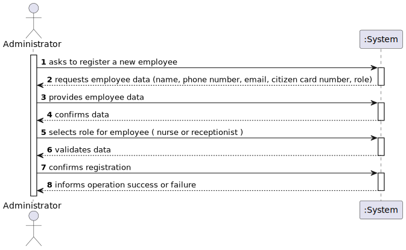
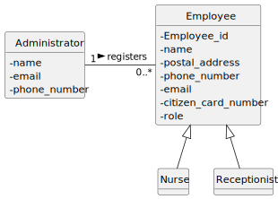
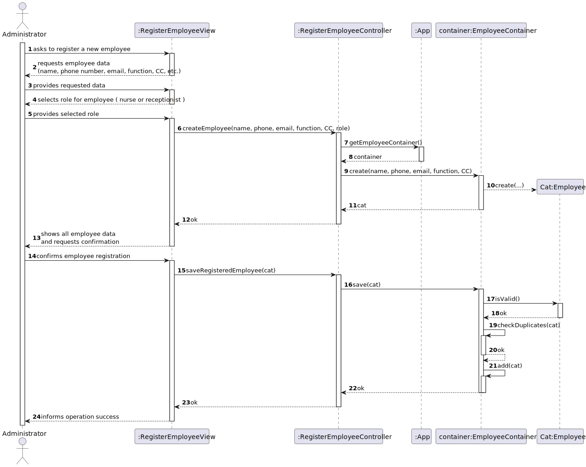
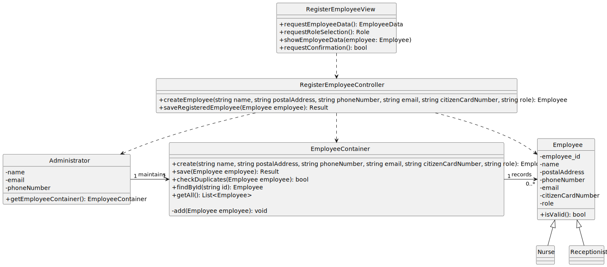

# US 14 - Register an Employee

## 1. Requirements Engineering

### 1.1. User Story Description

As an **Administrator**, I want to register an employee so that they can perform their role within the vaccination management system.

### 1.2. Customer Specifications and Clarifications

**From the specifications document:**

- Each employee must be assigned a single function/role within the system.
- The attributes **Name**, **Phone Number**, and **E-mail Address** are mandatory.
- The **Phone Number** and **Citizen Card Number** must comply with the Portuguese format.
- The **Phone Number** and **E-mail Address** must be unique across all registered employees.

**From the client clarifications:**

> **Question:** What roles can an employee have?  
> **Answer:** For now, there are two roles: **Nurse** and **Receptionist**.

> **Question:** Is it possible for the same person to have more than one role?  
> **Answer:** No. Each employee must have a single, unique role.

> **Question:** Who performs this registration?  
> **Answer:** Only an **Administrator** is allowed to register employees.

### 1.3. Acceptance Criteria

- **AC14-1:** Each employee must be assigned a single function/role within the system.
- **AC14-2:** The attributes Name, Phone Number, and E-mail Address are mandatory.
- **AC14-3:** The Phone Number and Citizen Card Number must comply with the Portuguese format.
- **AC14-4:** The Phone Number and E-mail Address must be unique across all registered employees.

### 1.4. Found out Dependencies

- Depends on the existence of an **Administrator** user.
- Depends on **Employee Role**  (Nurse, Receptionist) being registered in the system.

### 1.5. Input and Output Data

**Input Data:**

- Typed data:
    - Name
    - Postal Address
    - Phone Number
    - E-mail Address
    - Citizen Card Number
    - Role (selected from available roles)

**Output Data:**

- Confirmation of successful registration
- Error messages in case of duplicated or invalid data
- Generated Employee ID
- 
### 1.6. System Sequence Diagram (SSD)

### 1.7. Other Relevant Remarks

- Only administrators can access the employee registration functionality.
- Validation rules must be applied before saving the employee record.

---

## 2. OO Analysis

### 2.1. Relevant Domain Model Excerpt

### 2.2. Other Remarks

- The `Administrator` entity maintains the list of employees.
- The `Employee` entity aggregates common attributes, while specific subtypes (`Nurse`, `Receptionist`) can extend it.

---

## 3. Design - User Story Realization

### 3.1. Rationale

| Interaction ID | Question: Which class is responsible for...                        | Answer                                  | Justification (with patterns)                                                                                   |
|----------------|----------------------------------------------------------------------|-----------------------------------------|-----------------------------------------------------------------------------------------------------------------|
| Step 1         | ... interacting with the actor?                                       | RegisterEmployeeView                     | **Pure Fabrication**: mediates the interaction with the Administrator; not part of the Domain Model.          |
|                | ... coordinating the user story?                                      | RegisterEmployeeController               | **Controller**: orchestrates the registration use case.                                                        |
| Step 2         | ... requesting employee data?                                         | RegisterEmployeeView                     | **IE**: presents the form and collects data from the Administrator.                                           |
| Step 3         | ... typing/providing requested data?                                  | Administrator                            | **IE**: Admin provides name, phone, email, CC.                                                               |
|                | ... selecting role from available options?                             | Administrator                            | **IE**: Admin chooses the role (nurse or receptionist).                                                      |
|                | ... confirming selected role?                                         | RegisterEmployeeView                     | **IE**: displays selected role and requests confirmation.                                                    |
| Step 4         | ... validating and creating a new Employee?                           | RegisterEmployeeController               | **Controller**: coordinates validation and creation.                                                          |
|                | ... instantiating Employee object?                                     | EmployeeContainer + Employee             | **IE**: Container creates Employee; Employee encapsulates its data.                                           |
| Step 5         | ... showing all data and requesting confirmation?                     | RegisterEmployeeView                     | **IE**: displays Employee data and role to the Admin; asks for confirmation.                                   |
| Step 6         | ... confirming employee registration?                                  | Administrator                            | **IE**: Admin confirms the operation.                                                                        |
| Step 7         | ... saving the new Employee?                                           | RegisterEmployeeController + EmployeeContainer | **Controller** coordinates saving; Container checks duplicates and persists Employee.                       |
|                | ... validating all data?                                               | Employee                                 | **IE**: Employee validates its own data.                                                                    |
|                | ... checking duplicates?                                              | EmployeeContainer                         | **IE**: Container ensures no duplicate Employees exist.                                                     |
|                | ... adding Employee to container?                                      | EmployeeContainer                         | **IE**: Container stores Employee.                                                                          |
| Step 8         | ... informing operation success or failure?                            | RegisterEmployeeView                     | **IE**: presents the result to Admin; responsible for user interaction.                                       |

### Systematization

According to the taken rationale, the conceptual classes promoted to software classes are:

- `Administrator`
- `Employee`

Other software classes (Pure Fabrication) identified:

- `RegisterEmployeeView`
- `RegisterEmployeeController`
- `EmployeeContainer`

### 3.2. Sequence Diagram (SD)

### 3.3. Class Diagram (CD)

**Note:** Private attributes and/or methods were omitted.

---
