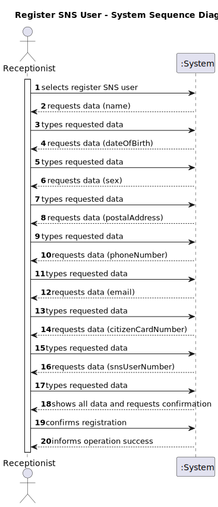
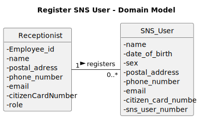
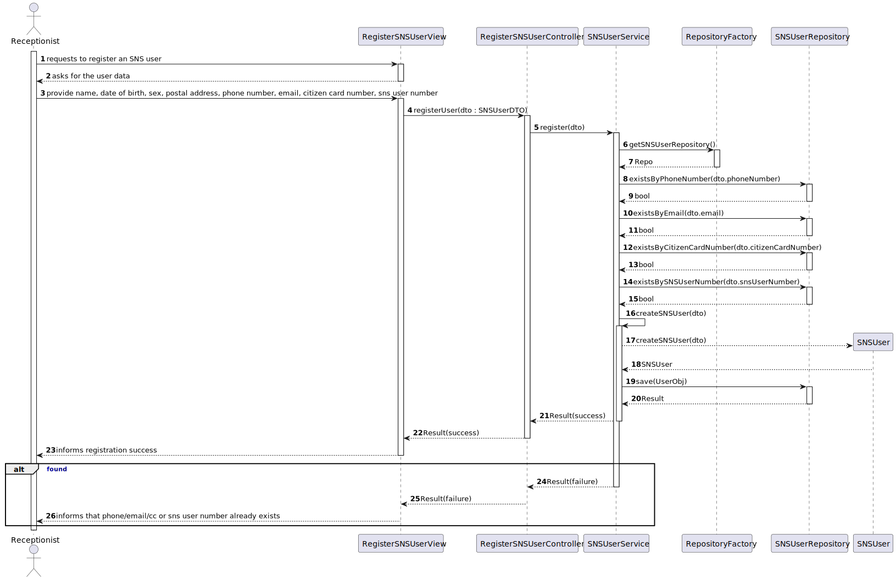
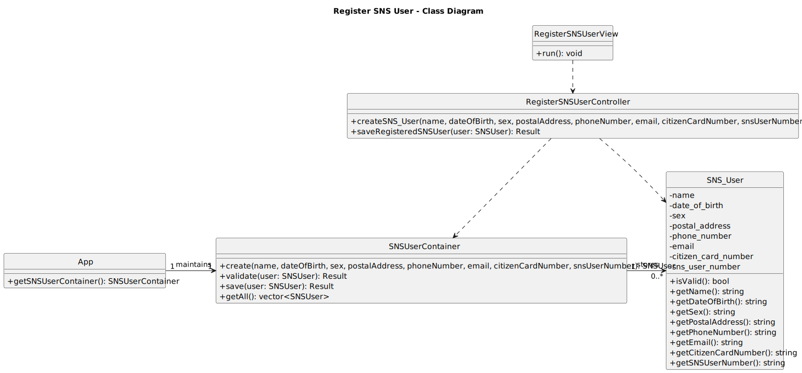

# US20 – Register an SNS user

## 1. Requirements Engineering

### 1.1. User Story Description

As a **Receptionist**, I want to register an SNS user so that the person can subsequently schedule a vaccination appointment.  The
user story belongs to sprint&nbsp;3 and has high priority.

### 1.2. Customer Specifications and Clarifications

### 1.3. Acceptance Criteria

The following acceptance criteria were established for US20:

1. **AC20‑1 – Format compliance:** the phone number and citizen card number must comply with the Portuguese format.
2. **AC20‑2 – Optional sex:** all fields are required except for the sex attribute.
3. **AC20‑3 – Uniqueness:** the phone number, e‑mail address, citizen card number and SNS user number must be unique across all registered users.

### 1.4. Found out Dependencies

Registering an SNS user is a pre‑requisite for the vaccine scheduling functionality (US30).  The current user story does not
depend on other features but relies on the existence of a service/repository infrastructure to store and query SNS users.  In
this sprint only an **in‑memory repository** is implemented; alternative persistence mechanisms can be plugged in through the
abstract factory introduced for repositories.

### 1.5. Input and Output Data

**Input data:**

- **Typed data:** name, date&nbsp;of&nbsp;birth, sex (optional), postal address, phone number, e‑mail address, citizen card number,
  SNS user number.
- **Selected data:** none.

**Output data:**

- A success or error message confirming whether the SNS user was registered.  In case of an error the message explains
  whether it concerns missing fields, format violations or duplicate data.

### 1.6. System Sequence Diagram (SSD)

### 1.7. Other Relevant Remarks

- Only receptionists are allowed to execute this use case.  Administrators register vaccination centres and personnel, whereas
  SNS users schedule appointments in a different user story.
- The system uses an **abstract factory** to obtain repositories.  In this sprint the **MemoryRepositoryFactory** returns
  an in‑memory implementation of the **SNSUserRepository**, but the architecture allows alternative persistence mechanisms to
  be introduced seamlessly.
- All validation and uniqueness checks are performed in the **SNSUserService**.  The repository merely persists data,
  following the separation of concerns recommended for the Service and Repository patterns.

---

## 2. OO Analysis

### 2.1. Relevant Domain Model Excerpt

### 2.2. Other Remarks

- The receptionist in the domain model is a specialization of **Employee** (see sprint&nbsp;2 domain model).  For brevity
  only the role necessary to understand this use case is shown.
- The SNS user number uniquely identifies a patient within the National Health Service and is not reused for other purposes.

---

## 3. Design – User Story Realization

### 3.1. Rationale

| Interaction ID | Question – Which class is responsible for…                   | Answer                      | Justification / pattern                                                                                           |
| -------------- | ------------------------------------------------------------ | --------------------------- | ----------------------------------------------------------------------------------------------------------------- |
| **Step 1**     | presenting the option to register a new SNS user?            | `MainView`                  | **Controller**: the main menu is a central controller of user interactions.                                       |
| **Step 2**     | requesting the user's name?                                  | `RegisterSNSUserView`       | **Information Expert**: the view knows the fields that must be collected from the user.                           |
| **Step 3**     | requesting the user's date of birth?                         | `RegisterSNSUserView`       | **Information Expert**: the view knows the fields that must be collected from the user.                           |
| **Step 4**     | requesting the user's sex?                                   | `RegisterSNSUserView`       | **Information Expert**: the view knows the fields that must be collected from the user.                           |
| **Step 5**     | requesting the user's postal address?                        | `RegisterSNSUserView`       | **Information Expert**: the view knows the fields that must be collected from the user.                           |
| **Step 6**     | requesting the user's phone number?                          | `RegisterSNSUserView`       | **Information Expert**: the view knows the fields that must be collected from the user.                           |
| **Step 7**     | requesting the user's email?                                 | `RegisterSNSUserView`       | **Information Expert**: the view knows the fields that must be collected from the user.                           |
| **Step 8**     | requesting the user's citizen card number?                   | `RegisterSNSUserView`       | **Information Expert**: the view knows the fields that must be collected from the user.                           |
| **Step 9**     | requesting the SNS user number?                              | `RegisterSNSUserView`       | **Information Expert**: the view knows the fields that must be collected from the user.                           |
| **Step 10**    | showing all collected data for confirmation?                 | `RegisterSNSUserView`       | **Pure Fabrication / UI**: the view handles user interactions and confirmation.                                   |
| **Step 11**    | confirming the user's data before submission?                | `RegisterSNSUserView`       | **Pure Fabrication / UI**: the view handles user interactions and confirmation.                                   |
| **Step 12**    | coordinating data collection between view and service?       | `RegisterSNSUserController` | **Controller**: it coordinates between the view and the service layer to process user data.                       |
| **Step 13**    | checking for existing phone number in the repository?        | `SNSUserService`            | **Information Expert**: the service knows the validation rules and queries the repository to enforce uniqueness.  |
| **Step 14**    | checking for existing email in the repository?               | `SNSUserService`            | **Information Expert**: the service knows the validation rules and queries the repository to enforce uniqueness.  |
| **Step 15**    | checking for existing citizen card number in the repository? | `SNSUserService`            | **Information Expert**: the service knows the validation rules and queries the repository to enforce uniqueness.  |
| **Step 16**    | checking for existing SNS user number in the repository?     | `SNSUserService`            | **Information Expert**: the service knows the validation rules and queries the repository to enforce uniqueness.  |
| **Step 17**    | creating the SNSUser object?                                 | `SNSUserService`            | **Creator / Service**: the service owns the business rules and creates domain objects.                            |
| **Step 18**    | saving the SNS user in the repository?                       | `SNSUserService`            | **Service**: the service delegates persistence to the repository, which handles data storage.                     |
| **Step 19**    | confirming the SNS user registration result?                 | `RegisterSNSUserController` | **Controller**: it coordinates between the service and the view, returning the result to inform the receptionist. |
| **Step 20**    | informing the receptionist of the successful registration?   | `RegisterSNSUserView`       | **Information Expert**: the view communicates messages back to the actor (Receptionist).                          |

**Systematization**

From the rationale the following conceptual classes are promoted to software classes:

- `SNSUser`
- `SNSUserService`
- `SNSUserRepository` (interface)
- `RepositoryFactory` (interface)
- `MemoryRepositoryFactory` (concrete factory)
- `SNSUserMemoryRepository` (concrete repository)
- `RegisterSNSUserController`
- `RegisterSNSUserView`

Other software classes identified:

- `App` – exposes the repository factory and SNSUserService.
- `MainView` – integrates the new menu option.

### 3.2. Sequence Diagram (SD)

### 3.3. Class Diagram (CD)

---

