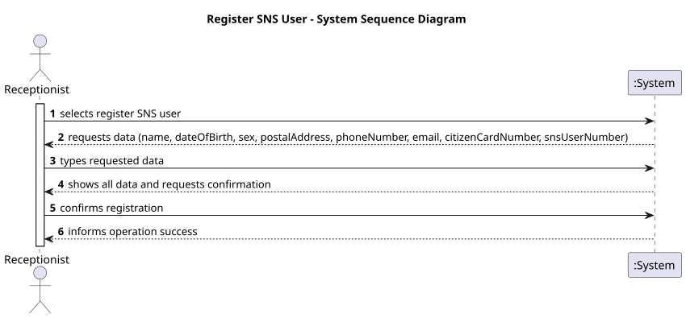
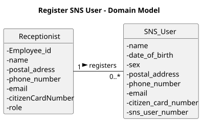
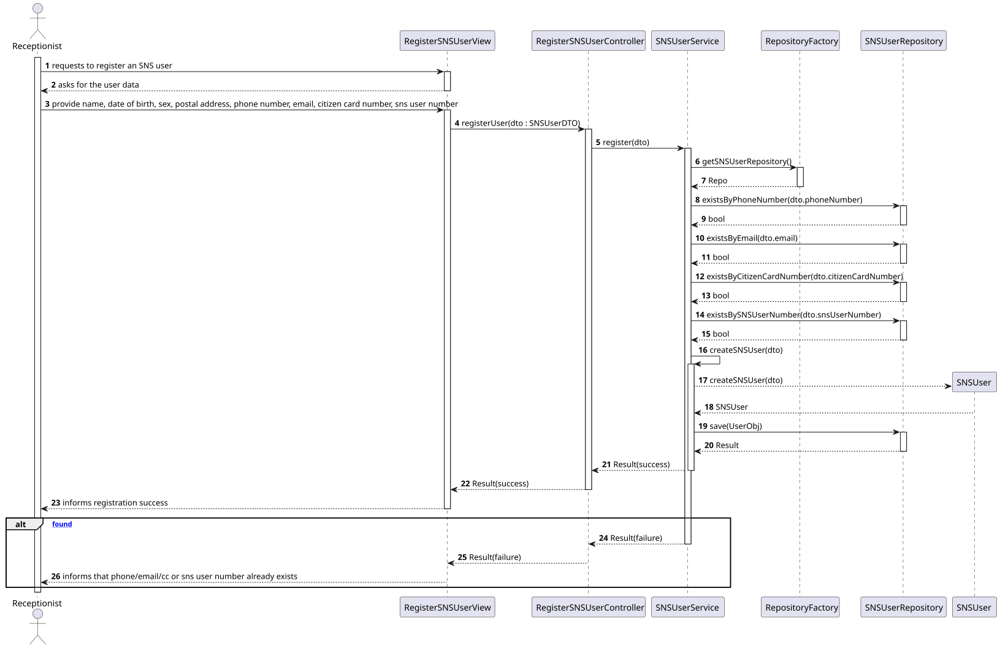
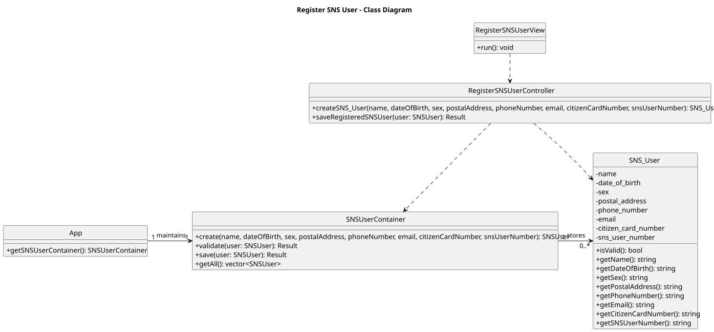

# US20 – Register an SNS user

## 1. Requirements Engineering

### 1.1. User Story Description

As a **Receptionist**, I want to register an SNS user so that the person can subsequently schedule a vaccination appointment.  The
user story belongs to sprint&nbsp;3 and has high priority.

### 1.2. Customer Specifications and Clarifications

### 1.3. Acceptance Criteria

The following acceptance criteria were established for US20:

1. **AC20‑1 – Format compliance:** the phone number and citizen card number must comply with the Portuguese format.
2. **AC20‑2 – Optional sex:** all fields are required except for the sex attribute.
3. **AC20‑3 – Uniqueness:** the phone number, e‑mail address, citizen card number and SNS user number must be unique across all registered users.

### 1.4. Found out Dependencies

Registering an SNS user is a pre‑requisite for the vaccine scheduling functionality (US30).  The current user story does not
depend on other features but relies on the existence of a service/repository infrastructure to store and query SNS users.  In
this sprint only an **in‑memory repository** is implemented; alternative persistence mechanisms can be plugged in through the
abstract factory introduced for repositories.

### 1.5. Input and Output Data

**Input data:**

- **Typed data:** name, date&nbsp;of&nbsp;birth, sex, postal address, phone number, e‑mail address, citizen card number,
  SNS user number.
- **Selected data:** none.

**Output data:**

- A success or error message confirming whether the SNS user was registered.  In case of an error the message explains
  whether it concerns missing fields, format violations or duplicate data.

### 1.6. System Sequence Diagram (SSD)

### 1.7. Other Relevant Remarks

- Only receptionists are allowed to execute this use case.  Administrators register vaccination centres and personnel, whereas
  SNS users schedule appointments in a different user story.
- The system uses an **abstract factory** to obtain repositories.  In this sprint the **MemoryRepositoryFactory** returns
  an in‑memory implementation of the **SNSUserRepository**, but the architecture allows alternative persistence mechanisms to
  be introduced seamlessly.
- All validation and uniqueness checks are performed in the **SNSUserService**.  The repository merely persists data,
  following the separation of concerns recommended for the Service and Repository patterns.

---

## 2. OO Analysis

### 2.1. Relevant Domain Model Excerpt

### 2.2. Other Remarks

- The receptionist in the domain model is a specialization of **Employee** (see sprint&nbsp;2 domain model).  For brevity
  only the role necessary to understand this use case is shown.
- The SNS user number uniquely identifies a patient within the National Health Service and is not reused for other purposes.

---

## 3. Design – User Story Realization

### 3.1. Rationale

| **Interaction ID** | **Question – Which class is responsible for…** | **Answer**            | **Justification / Pattern**                                                                              |
|--------------------|--------------------------------------------| --------------------- | -------------------------------------------------------------------------------------------------------- |
| **Step 1**         | ...selects register SNS user?              | `MainView`            | **Controller**: The main menu is a central controller for user interactions.                             |
| **Step 2**         | ...requests data (name, dateOfBirth, sex, postalAddress, phoneNumber, email, citizenCardNumber, snsUserNumber)?                   | `RegisterSNSUserView` | **Information Expert (IE)**: The view is responsible for requesting and displaying the user data fields. |
| **Step 3**         | ...types requested data ((name, dateOfBirth, sex, postalAddress, phoneNumber, email, citizenCardNumber, snsUserNumber))?                | `Receptionist`        | **Creator**: The receptionist provides the required data.                                                |
| **Step 4**         | ...shows all data and requests confirmation?  | `RegisterSNSUserView` | **IE**: The view displays all data to the receptionist for confirmation.                                 |
| **Step 5**         | ...confirms registration?                     | `Receptionist`        | **Creator**: The receptionist confirms the data.                                                         |
| **Step 6**         | ...informs operation success?                 | `RegisterSNSUserView` | **IE**: The view informs the receptionist that the registration was successful.                          |

**Systematization**

From the rationale the following conceptual classes are promoted to software classes:

- `SNSUser`
- `SNSUserService`
- `SNSUserRepository` (interface)
- `RepositoryFactory` (interface)
- `MemoryRepositoryFactory` (concrete factory)
- `SNSUserMemoryRepository` (concrete repository)
- `RegisterSNSUserController`
- `RegisterSNSUserView`

Other software classes identified:

- `App` – exposes the repository factory and SNSUserService.
- `MainView` – integrates the new menu option.

### 3.2. Sequence Diagram (SD)

### 3.3. Class Diagram (CD)

---

