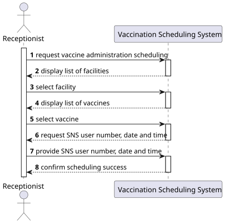
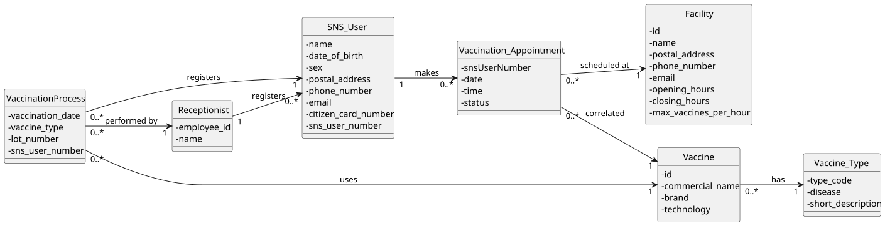
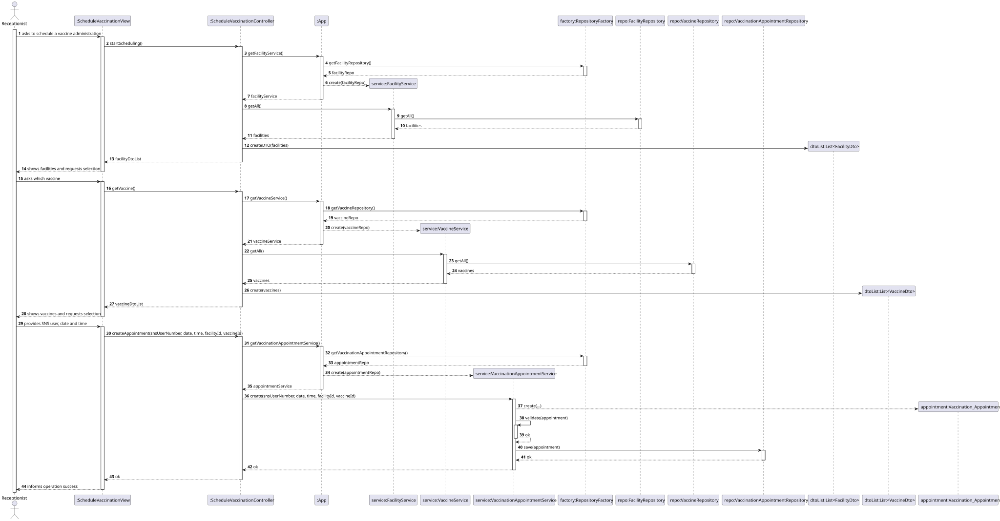
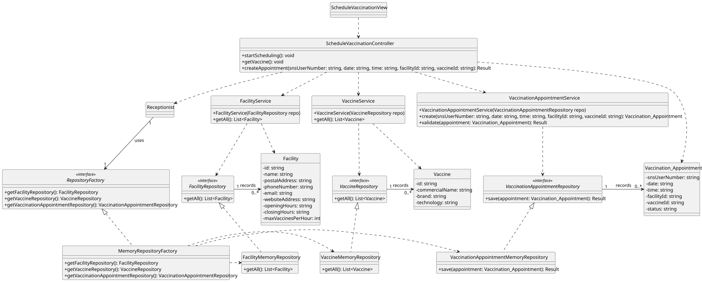

# US21 – Schedule a Vaccine Administration for an SNS User

---

## 1. Requirements Engineering

### 1.1. User Story Description

As a **Receptionist**, I want to **schedule a vaccine administration for an SNS user**, so that the user can receive a vaccine at a vaccination center on a specific date and time.

---

### 1.2. Customer Specifications and Clarifications

**From the specifications document:**

- Receptionists are responsible for managing vaccination appointments.
- A vaccination appointment associates:
  - an SNS user,
  - a vaccination center,
  - a date and time.

- In the scheduling record of a vaccine administration, the following information must be stored:
  - Date and time of the appointment;
  - Vaccination center where the vaccine administration will take place;
  - Type of vaccine to be administered (when applicable);
  - Identification of the SNS user for whom the appointment is scheduled.

- A scheduling is always associated with **a single vaccination center**.
- The scheduling can be performed for **any available vaccination center**, whether it is a healthcare center or a community mass vaccination center.

**From the client clarifications:**

- An SNS user **must not have overlapping vaccination appointments**.
- Appointments are **limited by the maximum number of vaccines that a vaccination center can administer per hour**.

---

### 1.3. Acceptance Criteria

- The SNS user must be identified by their **SNS user number**.
- A vaccination appointment must include:
  - SNS user number;
  - Vaccination center;
  - Date;
  - Time;
  - Vaccine type (when applicable).
- The selected date and time must be **available at the chosen vaccination center**, considering its hourly capacity.
- An SNS user must **not have another appointment scheduled at the same date and time**.
- The system must confirm the **successful scheduling** of the vaccination appointment.

---

### 1.4. Found Out Dependencies

- SNS users must be previously registered in the system.
- Vaccination centers must be previously registered.
- Vaccine types must be previously specified.
- This user story precedes:
  - US22 – Register SNS User Arrival
  - US41 – Record Vaccine Administration

---

### 1.5. Input and Output Data

#### Input Data

- **Typed data:**
  - SNS user number
  - Desired date
  - Desired time

- **Selected data:**
  - Vaccination center
  - Vaccine type (when applicable)

#### Output Data

- Confirmation of the scheduled vaccination appointment
- Scheduled appointment details:
  - SNS user
  - Vaccination center
  - Date
  - Time
  - Vaccine type (when applicable)

---
### 1.6. System Sequence Diagram (SSD)

### 1.7. Other Relevant Remarks

- At this stage of the project, **in-memory data persistence** is acceptable.
- Scheduling must comply with **data integrity rules**, preventing overlapping appointments and capacity overflow.
- This user story focuses **exclusively on scheduling**. Arrival registration and vaccine administration are handled in subsequent user stories.

---

## 2. OO Analysis

### 2.1. Relevant Domain Model Excerpt

The following domain concepts are involved in this user story:

- SNS User
- Vaccination Appointment
- Vaccination Center (Facility)
- Vaccine Type
- Receptionist

---

### 2.2. Other Remarks

- No domain state changes occur beyond the creation of a new vaccination appointment.
- Validation rules regarding conflicts and center capacity belong to the **service/domain layer**, not to the UI.

---

## 3. Design – User Story Realization

### 3.1. Rationale

- The Receptionist interacts with the system through a dedicated scheduling interface.
- Business rules such as:
  - overlapping appointments,
  - vaccination center hourly capacity  
    are enforced at the **service layer**.
- The design follows a **layered architecture**, separating:
  - User Interface
  - Application/Controller
  - Domain and Persistence

#### Responsibility Assignment (GRASP)

| Interaction ID | Question: Which class is responsible for... | Answer | Justification |
|----------------|---------------------------------------------|--------|---------------|
| Step 1 | ... interacting with the Receptionist? | ScheduleVaccinationView | **Pure Fabrication**: handles user interaction. |
| | ... coordinating the user story? | ScheduleVaccinationController | **Controller**: orchestrates the use case. |
| Step 2 | ... requesting available vaccination centers? | ScheduleVaccinationController | **Controller**: coordinates retrieval. |
| | ... providing vaccination centers? | FacilityService | **Information Expert**: knows facilities. |
| Step 3 | ... selecting a vaccination center? | Receptionist | **IE**: actor provides the choice. |
| Step 4 | ... requesting available vaccines? | ScheduleVaccinationController | **Controller** responsibility. |
| | ... providing vaccines? | VaccineService | **Information Expert**. |
| Step 5 | ... typing SNS user number, date and time? | Receptionist | **IE**: actor provides data. |
| Step 6 | ... validating scheduling constraints? | VaccinationAppointmentService | **IE**: enforces business rules. |
| | ... creating the appointment? | VaccinationAppointmentService | **Creator**: creates VaccinationAppointment. |
| Step 7 | ... persisting the appointment? | VaccinationAppointmentRepository | **IE**: manages persistence. |
| Step 8 | ... informing operation success? | ScheduleVaccinationView | **IE**: presents result to user. |

---
### Systematization

According to the taken rationale, the conceptual classes promoted to software classes are:

- `SNSUser`
- `VaccinationAppointment`
- `VaccinationCenter`
- `VaccineType`

Other software classes (Pure Fabrication) identified:

- `ScheduleVaccinationView`
- `ScheduleVaccinationController`
- `VaccinationAppointmentService`
- `FacilityService`
- `VaccineService`
- `VaccinationAppointmentRepository`
- `RepositoryFactory`

---

### 3.2. Sequence Diagram (SD)

The following Sequence Diagram details the internal interactions that occur **inside the system boundary** after the Receptionist initiates the scheduling process, as described in the SSD.

---

### 3.3. Class Diagram (CD)

The Class Diagram illustrates the main classes involved in scheduling a vaccination appointment, including controllers, services, repositories, and domain entities.

**Note:** Private attributes and helper methods were omitted for readability.
