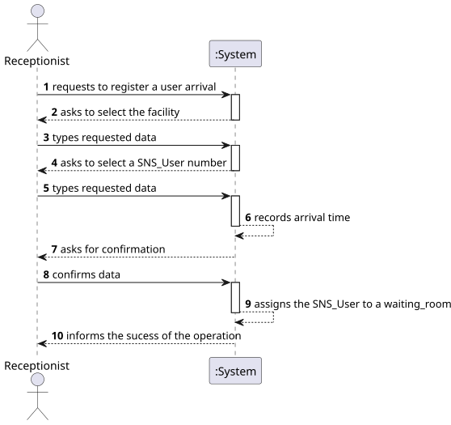
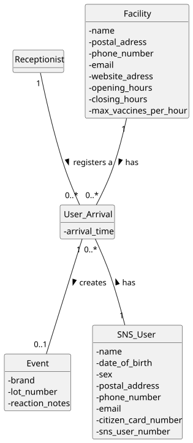
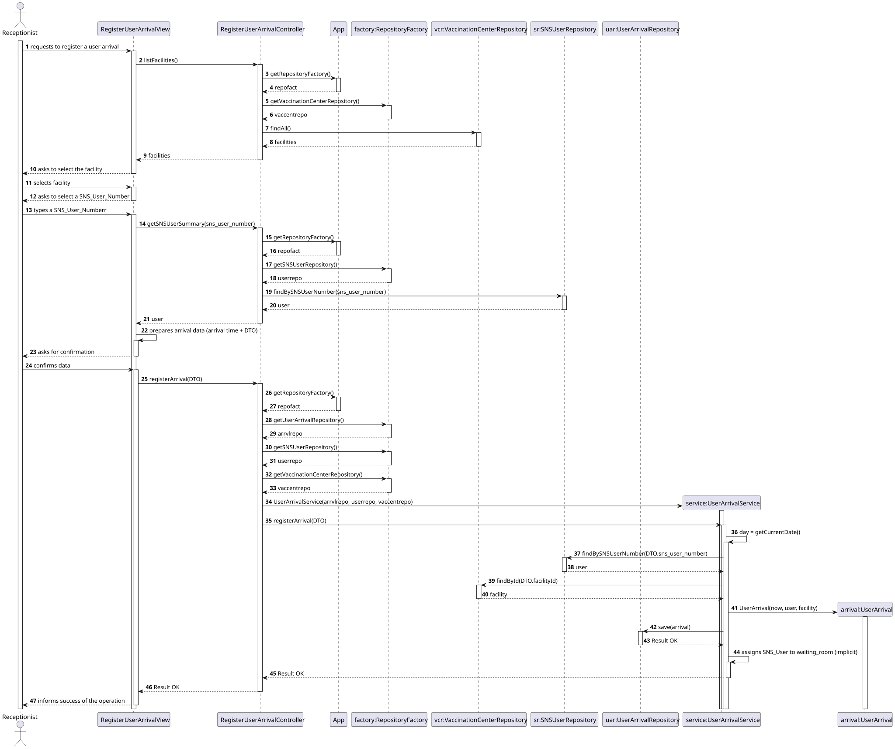
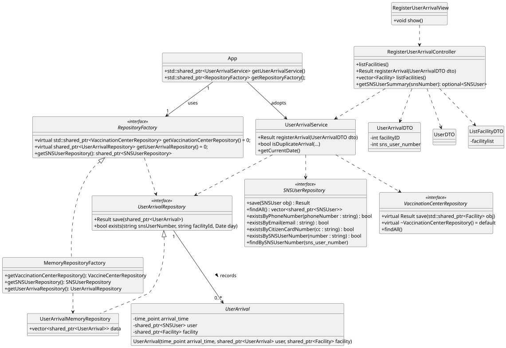

1# US10 - Specify a new vaccine type

## 1. Requirements Engineering

### 1.1. User Story Description

-  As Receptionist, I want to register the arrival of an SNS user at the vaccination center to take the vaccine.

### 1.2. Customer Specifications and Clarifications

**From the client clarifications:**

> **Question:** >
> **Answer:**   >

### 1.3. Acceptance Criteria

-  AC22-1: No duplicate entries should be possible for the same SNS user on the same day.
-  AC22-2: The SNS user should be assigned to the waiting room.

### 1.4. Found out Dependencies

- The arrival register is dependent of a existing vaccination center.
- The arrival register is dependent of a exiting SNS user.
- The arrival register is dependent of a existing vaccination appointment.

### 1.5 Input and Output Data
 '                                      '
**Input Data:**

- **Typed Data:**

- SNS user number

- **Selected Data:**
- Facility

**Output Data:**
- Confirmation of arrival registration or error message in case of duplicate entry

### 1.6. System Sequence Diagram (SSD)

### 1.7. Other Relevant Remarks

---

## 2. OO Analysis

### 2.1. Relevant Domain Model Excerpt

### 2.2. Other Remarks

- n/a

---

## 3. Design - User Story Realization

### 3.1. Rationale

- This rationale table follows the steps for the creation of a Facility with the type Mass Community Vaccination Center.

| Interaction ID | Question: Which class is responsible for...                                                       | Answer                              | Justification (with patterns)                                                                                                                     |
|----------------|---------------------------------------------------------------------------------------------------|-------------------------------------|---------------------------------------------------------------------------------------------------------------------------------------------------|
| Step 1         | ... interacting with the actor?                                                                   | RegisterUserArrivalView             | **Pure Fabrication**: There is no reason to assign this responsibility to any existing class in the Domain Model.                                 |
|                | ... coordinating the user story?                                                                  | RegisterUserArrivalController       | **Controller**: Mediates between the view and the model.                                                                                          |
| Step 2         | ... asking to select the facility?                                                                | RegisterUserArrivalView             | IE: is responsible for user interactions.                                                                                                         |
|                | ... providing the list of facilities to the View?                                                 | RegisterUserArrivalController       | Controller: the Controller orchestrates the request for reference data needed by the UI.                                                          |
|                | ... retrieving all facilities from storage?                                                       | VaccinationCenterRepository         | Information Expert: the repository knows and provides access to stored facilities/centers.                                                        |
|                | ... providing the correct concrete repository implementation?                                     | RepositoryFactory                   | Protected Variations: clients depend on interfaces, the factory encapsulates which concrete repository is used.                                   |
| Step 3		   	   | ... selecting the facility?                                                                       | Receptionist                        | The actor selects the facility in the UI.                                                                                                         |
| Step 4         | ... asking the SNS user number?                                                                   | RegisterUserArrivalView             | Pure Fabrication/UI: prompting for input is a UI responsibility.                                                                                  |
| Step 5         | ... typing the SNS user number?                                                                   | Receptionist                        | The receptionist provides the SNS user number, to register the related user arrival.                                                              |
| Step 6         | ... recording the arrival time?                                                                   | UserArrivalService                  | Information Expert: the service applies business rules and system-driven values. Keeps UI free from business logic.                               |
| Step 7         | ... showing all data and requesting confirmation?                                                 | RegisterUserArrivalView             | Pure Fabrication/UI: confirmation is a user interaction concern.                                                                                  |
| Step 8         | ... confirming the data?                                                                          | Receptionist                        | The receptionist confirms the data.                                                                                                               |
| Step 9         | ... building a structured object with all input data?                                             | UserArrivalDTO                | **Low Coupling**: DTO prevents the View from depending directly on internal domain structures.                                                    |
|                | ... showing all data and requesting confirmation?                                                 | RegisterVaccinationCenterView       | IE: is responsible for user interactions.                                                                                                         |
|                | ... invoking the registration operation after confirmation?                                       | RegisterUserArrivalController                               | Controller: forwards the DTO to the application/service layer.                                                                                    |
|                | ... validating business rules (e.g., no duplicates in the same day) and coordinating persistence? | UserArrivalService | Information Expert + Low Coupling: business logic belongs in the service; it coordinates repositories without exposing persistence details to UI. |
|                | ... checking whether an arrival already exists for the same SNS user on the same day (AC22-1)?    | UserArrivalRepository            | Information Expert: the repository can efficiently answer existence queries over stored arrivals.                                                 |
|                | ... persisting the arrival record?                                                                | UserArrivalRepository               | Information Expert: repository store and retrieve domain objects.                                                                                 |
|                | ... creating the UserArrival domain object?                                                       | UserArrivalService            | Creator: the service has the data required (facility, SNS user, arrival time) and controls the creation process aligned with business rules.                                      |
|                | ... obtaining the SNS user data needed for the registration?                                      | SNSUserRepository            | Information Expert: provides access to stored SNS users for validation and association.                                                                |
|                | ... obtaining the selected facility data needed for the registration?                             | VaccinationCenterRepository         | IE: Responsible for storing all Facility objects.                                                                                                 |
|                | ... assigning the SNS user to the waiting room (AC22-2)?                                          | UserArrivalService                   | Information Expert: the service enforces the workflow; in this iteration, “assigned to waiting room” is represented by the existence of a registered arrival for the facility/day (queue implied).                                                        |
| Step 10        | ... informing the operation sucess?                                                               | RegisterUserArrivalView       | IE: is responsible for user interactions.                                                                                                         |

### Systematization

According to the taken rationale, the conceptual classes promoted to software classes are:

- Receptionist
- SNS_User
- Facility
- User_Arrival

Other software classes (i.e., Pure Fabrication) identified:

- RegisterUserArrivalView
- RegisterUserArrivalController
- UserArrivalService
- UserArrivalRepository
- VaccinationCenterRepository
- SNSUserRepository
- UserArrivalMemoryRepository
- MemoryRepositoryFactory
- RepositoryFactory
- UserArrivalDTO
- App

### 3.2. Sequence Diagram (SD)

### 3.3. Class Diagram (CD)

## 4. Tests

Three relevant test scenarios are highlighted next.
Other test were also specified.

**Test 1:** Check that it is not possible to register an arrival with invalid data (e.g., invalid facility id or SNS user number).

    TEST_F(UserArrivalServiceFixture, RegisterArrivalWithInvalidDataShouldFail) {
        UserArrivalDTO dto;
        dto.facilityID = 0;          // invalid
        dto.sns_user_number = 12345; // valid

        Result res = service->registerArrival(dto);
        EXPECT_TRUE(res.isNOK());
    }

**Test 2:** Check that when there is no appointment for the SNS user on the current day (AC: appointment must exist), the arrival is not saved.

      TEST_F(UserArrivalServiceFixture, NoAppointmentForTodayShouldNotPersistArrival) {
        UserArrivalDTO dto;
        dto.facilityID = 10;
        dto.sns_user_number = 12345;

        EXPECT_CALL(*apptRepo, existsForDay("12345", dto.facilityID, _))
            .Times(1)
            .WillOnce(Return(false));

        EXPECT_CALL(*arrivalRepo, save(_)).Times(0);

        Result res = service->registerArrival(dto);
        EXPECT_TRUE(res.isNOK());
      }

**Test 3:** Check that when an appointment exists for today, the arrival is persisted successfully.

     TEST_F(UserArrivalServiceFixture, AppointmentExistsForTodayShouldPersistArrival) {
        UserArrivalDTO dto;
        dto.facilityID = 10;
        dto.sns_user_number = 12345;

        EXPECT_CALL(*apptRepo, existsForDay("12345", dto.facilityID, _))
            .Times(1)
            .WillOnce(Return(true));

        EXPECT_CALL(*arrivalRepo, save(_))
            .Times(1)
            .WillOnce(Return(Result::OK()));

        Result res = service->registerArrival(dto);
        EXPECT_TRUE(res.isOK());
    }

## 5. Construction (Implementation)

n/a

## 6. Integration and Demo

A menu option (MainView) on the console application was added.
This option invokes the RegisterUserArrivalView, which collects the required inputs from the receptionist and calls the RegisterUserArrivalController.

Example integration in MainView::handleOption:

void MainView::handleOption(int option) {
switch (option) {
// ...
case X: {
auto svc = app.getUserArrivalService(); // or getArrivalService()
RegisterUserArrivalController c(svc);
RegisterUserArrivalView v(c);
v.show();
break;
}
// ...
}
    }

## 7. Observations

- n/a
