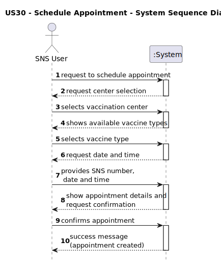
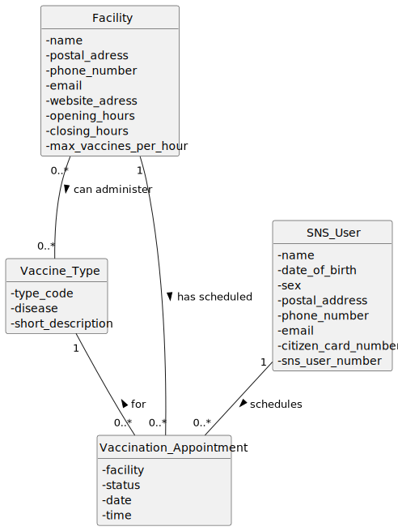
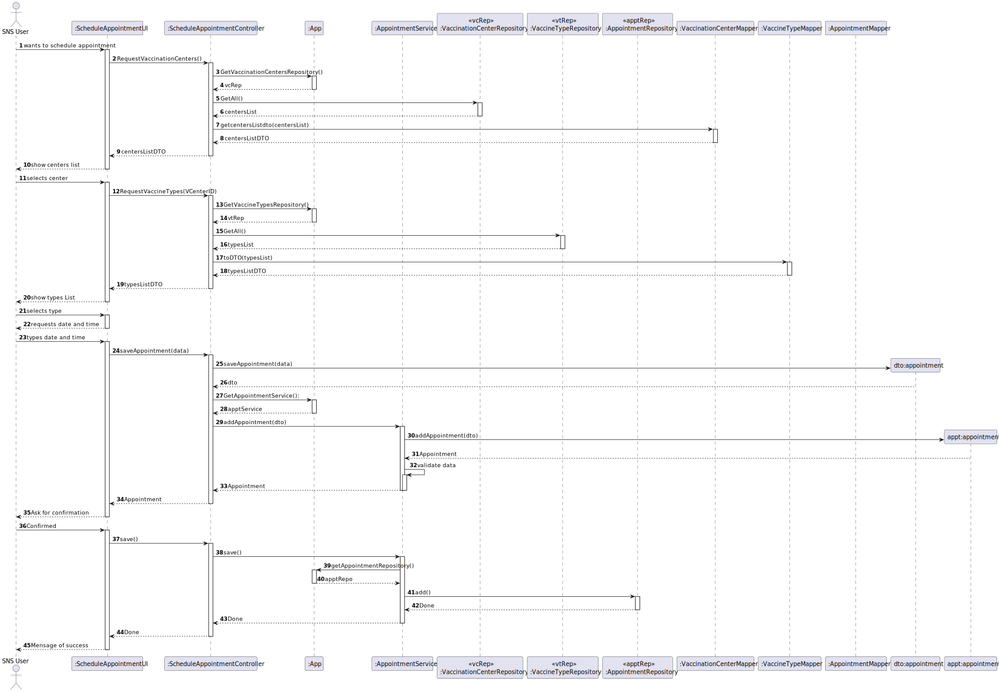

# US30 - Schedule a Vaccine Administration Appointment

## 1. Requirements Engineering

### 1.1 User Story Description

As an **SNS User**, I want to **schedule a vaccine administration**, so that I can receive the appropriate vaccination at a selected vaccination center.

### 1.2 Customer Specifications and Clarifications

- AC30-1: The SNS user must be registered in the system.
- AC30-2: The user must select a **vaccination center**.
- AC30-3: The user must select a **vaccine type** available at the selected center.
- AC30-4: The user must select a **date and time** for the appointment.
- AC30-5: The system must check **capacity constraints** of the selected center.
- AC30-6: The system must confirm the information with the user before saving.

### 1.3 Acceptance Criteria

| ID | Acceptance Criteria |
|:--:|--------------------|
| AC30-1 | Appointment is only valid for existing SNS users |
| AC30-2 | Appointment must be linked to an existing vaccination center |
| AC30-3 | Vaccine type must be one available at chosen center |
| AC30-4 | Appointment must not exceed the maximum capacity of the center |
| AC30-5 | User must confirm before the appointment is saved |
| AC30-6 | A success message must be shown upon conclusion |

### 1.4 Found Dependencies

- **US01** – Register SNS User
- **US09/US11** – Register Vaccination Centers and Vaccines
- **US15** – Manage Employees and center functionality

### 1.5 Input and Output Data

**Input:**
- User inputs:
    - Selected vaccination center
    - Selected vaccine type
    - Appointment date and time
    - SNS Number

**Output:**
- Operation success or failure message

### 1.6 System Sequence Diagram (SSD)

> SSD Code reference:
\`\`\`plantuml
<inserir o código SSD que já te dei anteriormente>
\`\`\`

---

## 2. OO Analysis

### 2.1 Relevant Domain Model Excerpt

Entities involved:
- `SNS_User`
- `Facility`
- `Vaccine_Type`
- `Vaccination_Appointment`

### 2.2 Other Remarks

- The SNS User may have multiple appointments (0..*)
- The Facility enforces vaccination limits per hour
- The system must validate all input before appointment creation

---

## 3. Design — Realization of the User Story

### 3.1 Rationale

| Step | Question: Which class is responsible for... | Answer | Justification |
|:---:|----------------------------------------------|--------|---------------|
| 1 | interacting with the user? | ScheduleAppointmentUI | UI responsibility |
| 2 | coordinating all required operations? | ScheduleAppointmentController | Controller pattern |
| 3 | providing available vaccination centers? | VaccinationCenterRepository | Repository owns collection |
| 4 | providing available vaccine types? | VaccineTypeRepository | Repository stores vaccine types |
| 5 | validating business rules and creating appointment domain object? | AppointmentService | Business logic responsibility |
| 6 | mapping DTO <-> Domain | AppointmentMapper | Separation of concerns |
| 7 | persisting the new appointment? | AppointmentRepository | Repository responsibility |
| 8 | returning appointment confirmation to be shown to the user | ScheduleAppointmentUI | UI output responsibility |

### 3.2 Sequence Diagram (SD)

> SD Code reference:
\`\`\`plantuml
<inserir código SD final gerado anteriormente>
\`\`\`

### 3.3 Class Diagram (CD)

---

## 4. Implementation Notes

- The DTO ensures that UI and Domain layers remain decoupled.
- All business rules are centralized inside the `AppointmentService`.
- Persistence is temporarily in-memory during prototype releases (Sprint scope).

---

## 5. Status

| State | Completed by |
|------:|--------------|
| ✔ Design artifacts ready | Development Team |

/