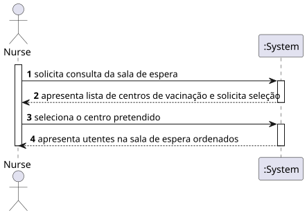
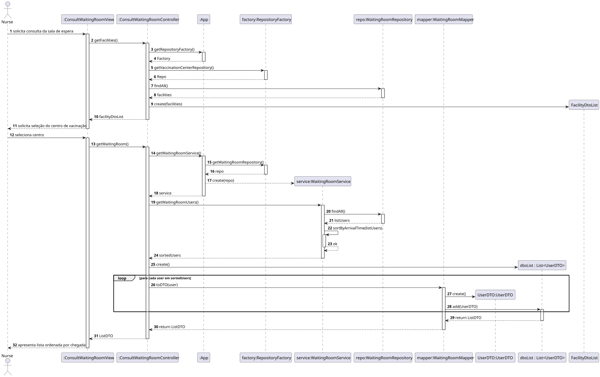
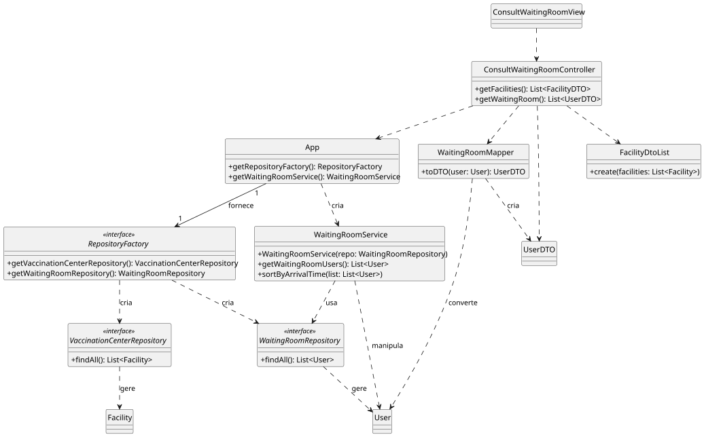

# US40 – Consult Waiting Room Users

## 1. Requirements Engineering

### 1.1 User Story Description

As a **Nurse**, I intend to **consult the users in the waiting room of a vaccination center**,  
so that I can know which users are waiting to be vaccinated.

### 1.2 Customer Specifications and Clarifications

- Only authenticated **Nurses** can perform this operation.
- The list of users shown corresponds to **one vaccination center** selected by the nurse.
- The list must respect the **order of arrival** of the users.

### 1.3 Acceptance Criteria

| ID | Description |
|:--:|-------------|
| **AC40-1** | The list of SNS users must be presented on a **first-come, first-served (FIFO)** basis |
| **AC40-2** | Only users that are currently in the waiting room are displayed |
| **AC40-3** | If no users are in the waiting room, an empty list must be shown |
| **AC40-4** | The nurse cannot edit or remove waiting users in this use case |

### 1.4 Dependencies

- **US30 – Schedule Appointment**
- **US35 – Register User Arrival**
- **Authentication/roles** (nurse permissions)

### 1.5 Input and Output Data

#### Input Data

- Selected vaccination center

#### Output Data

- Ordered list of users in the waiting room:
    - Name
    - SNS user number
    - (implicitly ordered by arrival time)

### 1.6 System Sequence Diagram (SSD)

Interaction flow:

1. Nurse requests consultation of waiting room
2. System presents vaccination centers and requests selection
3. Nurse selects center
4. System presents users in waiting room ordered first-come, first-served

---

## 2. OO Analysis

### 2.1 Relevant Domain Model Excerpt

Relevant concepts:

- Nurse
- Vaccination Center
- Waiting Room
- SNS User

Waiting room is associated to one vaccination center and contains users currently waiting for vaccination.

### 2.2 Other Remarks

- Ordering is based on **arrival timestamp**
- Business rule is handled in the **service layer**, not in UI

---

## 3. Design – Realization of the User Story

### 3.1 Rationale (aligned with 4 SSD steps)

| Step | Responsibility Question | Class | Justification |
|:----:|--------------------------|-------|---------------|
| 1 | Who interacts with the Nurse and starts the consultation? | ConsultWaitingRoomView | UI element for interaction |
| 2 | Who obtains list of vaccination centers? | ConsultWaitingRoomController | Coordinates between UI and domain |
| 3 | Who retrieves users in selected center waiting room? | WaitingRoomService | Applies business logic |
| 4 | Who guarantees first-come, first-served ordering and returns list to UI? | WaitingRoomService | Enforces AC40-1 |

---

### 3.2 Sequence Diagram (SD)

---

### 3.3 Class Diagram (CD)

---

## 4. Tests

Tratar depois de implementar código

## 5. Construction (Implementation)

Tratar depois de implementar código

## 6. Integration and Demo

Tratar depois de implementar código

## 7. Observations

- n/a
