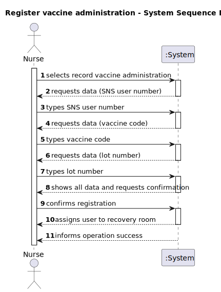
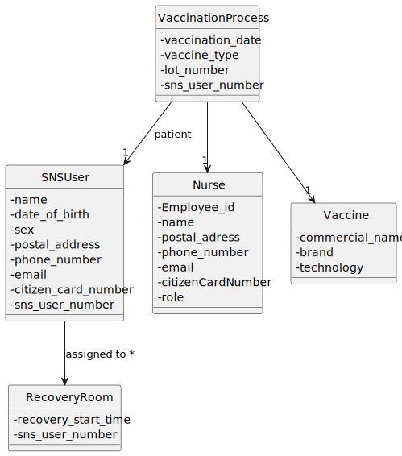
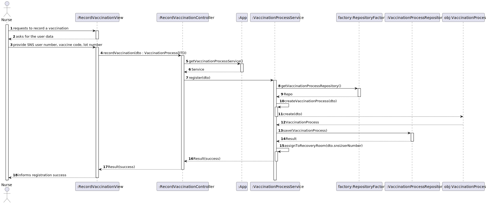
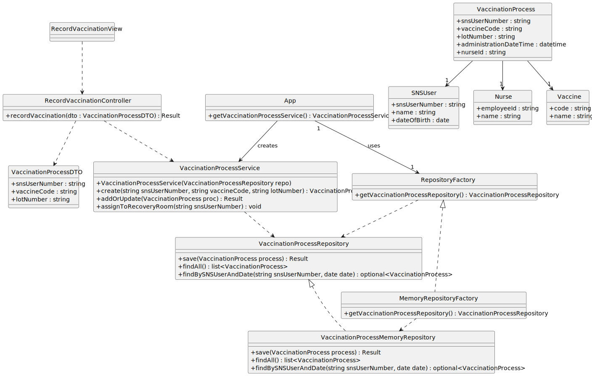

# US41 – Record vaccine administration

## 1. Requirements Engineering

### 1.1. User Story Description

As a **Nurse**, I want to record the administration of a vaccine to an SNS user so that the vaccination event is properly registered and the user can be assigned to the recovery room.  This user story belongs to sprint 4 and has high priority.

### 1.2. Customer Specifications and Clarifications

### 1.3. Acceptance Criteria

The following acceptance criteria were established for US41:

1. **AC41‑1 – Select vaccine and lot:** the nurse should select a vaccine and the administered lot number【954956048189931†L17-L20】.
2. **AC41‑2 – Assign recovery room:** after recording the administration, the SNS user should be assigned to the recovery room【954956048189931†L19-L20】.

### 1.4. Found out Dependencies

Recording a vaccine administration depends on previous user stories:

* **US20 – Register an SNS user:** the SNS user must exist in the system.
* **US21/US22 – Schedule and register arrival:** the SNS user must have a scheduled appointment and must have checked in to the waiting room before a nurse can record the administration.
* **US12/US11 – Vaccine management:** vaccines and their lots must be registered beforehand so that the nurse can select the correct vaccine and lot number.

In this sprint only an **in‑memory repository** is implemented; alternative persistence mechanisms can be plugged in through the abstract factory introduced for repositories.

### 1.5. Input and Output Data

**Input data:**

- **Typed data:** SNS user number, vaccine code and administered lot number.
- **Selected data:** the SNS user is selected from the waiting‑room list and the vaccine is selected from the available vaccines; for simplicity the interaction is modelled as typed identifiers.

**Output data:**

- A success message confirming that the vaccine administration was recorded and the SNS user was assigned to the recovery room.

### 1.6. System Sequence Diagram (SSD)

### 1.7. Other Relevant Remarks

- Only nurses are allowed to execute this use case.  Administrators and receptionists have different responsibilities.
- The system uses an **abstract factory** to obtain repositories.  In this sprint the **MemoryRepositoryFactory** returns in‑memory implementations of the repositories, but the architecture allows alternative persistence mechanisms to be introduced seamlessly.
- All validation and business rules are performed in the **VaccinationProcessService** (a service introduced in this sprint).  Repositories merely persist data, following the separation of concerns recommended for the Service and Repository patterns.

---

## 2. OO Analysis

### 2.1. Relevant Domain Model Excerpt

### 2.2. Other Remarks

- The nurse is a specialization of **Employee**.  For brevity only the role necessary to understand this use case is shown.
- The **VaccinationProcess** encapsulates the date/time of administration, the SNS user, the nurse, the vaccine and the administered lot number.  It is persisted by the **VaccinationProcessRepository**.
- The SNS user has a state attribute that indicates whether they are in the waiting room, under observation in the recovery room or free to leave.  This attribute is updated by the service when the administration is recorded.

---

## 3. Design – User Story Realization

### 3.1. Rationale

The following table identifies which class is responsible for each step of the interaction, using GRASP patterns such as **Information Expert**, **Creator**, **Controller** and **Pure Fabrication**.

| Interaction ID | Question – Which class is responsible for… | Answer | Justification / pattern |
|---|---|---|---|
| **Step 1** | presenting the option to record a vaccine administration? | `MainView` | **Controller**: the main menu is a central controller of user interactions. |
| **Step 2** | requesting the SNS user number? | `RecordVaccineAdministrationView` | **Information Expert**: the view knows the fields that must be collected from the nurse. |
| **Step 3** | requesting the vaccine code? | `RecordVaccineAdministrationView` | **Information Expert**: the view knows the fields that must be collected from the nurse. |
| **Step 4** | requesting the lot number? | `RecordVaccineAdministrationView` | **Information Expert**: the view knows the fields that must be collected from the nurse. |
| **Step 5** | showing all collected data and asking for confirmation? | `RecordVaccineAdministrationView` | **Pure Fabrication / UI**: the view handles user interactions and confirmation. |
| **Step 6** | confirming the data? | `Nurse` | **Creator**: in the domain model the nurse records the vaccination process. |
| **Step 7** | coordinating the interaction between the view and the service? | `RecordVaccineAdministrationController` | **Controller**: mediates between the UI and the service layer. |
| **Step 8** | obtaining repositories for SNS users, vaccines and vaccination processes? | `RepositoryFactory` | **Protected Variations**: hides which concrete repository is used; clients depend only on interfaces. |
| **Step 9** | validating the SNS user number, vaccine code and lot number? | `VaccinationProcessService` | **Information Expert**: the service contains the business rules and uses the repositories to check existence and state. |
| **Step 10** | creating the VaccinationProcess domain object? | `VaccinationProcessService` | **Creator / Service**: the service has all necessary data and business rules to instantiate the process. |
| **Step 11** | persisting the vaccination process? | `VaccinationProcessRepository` | **Information Expert**: responsible for storing all vaccination processes. |
| **Step 12** | assigning the SNS user to the recovery room? | `VaccinationProcessService` | **Information Expert**: updates the state of the SNS user through the SNS user repository. |
| **Step 13** | informing the nurse of the operation success? | `RecordVaccineAdministrationView` | **Information Expert**: the view communicates messages back to the actor. |

**Systematization**

According to the rationale the following conceptual classes are promoted to software classes:

- `VaccinationProcess`
- `VaccinationProcessService`
- `VaccinationProcessRepository` (interface)
- `RepositoryFactory` (interface)
- `MemoryRepositoryFactory` (concrete factory)
- `VaccinationProcessMemoryRepository` (concrete repository)
- `RecordVaccineAdministrationController`
- `RecordVaccineAdministrationView`
- `VaccinationProcessDTO`

Other software classes identified:

- `App` – exposes the repository factory and VaccinationProcessService.
- `MainView` – integrates the new menu option.
- `VaccineRepository` and `SNSUserRepository` – existing interfaces used by the service.
- `Vaccine`, `SNSUser` and `Nurse` – existing domain classes used by the process.

### 3.2. Sequence Diagram (SD)

### 3.3. Class Diagram (CD)

---
