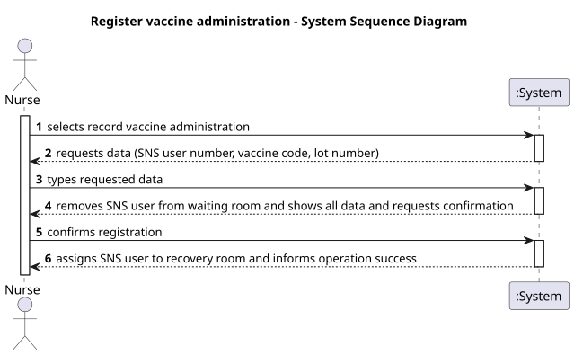
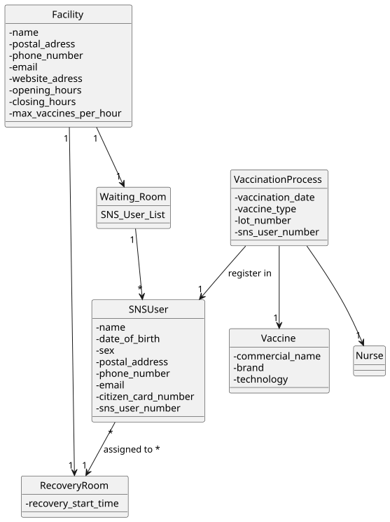
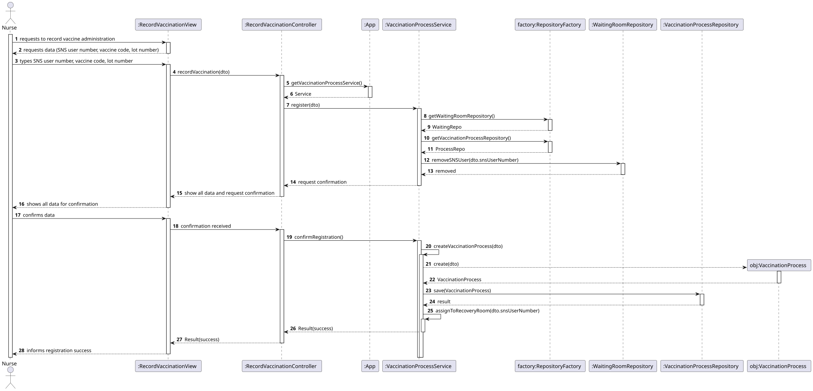
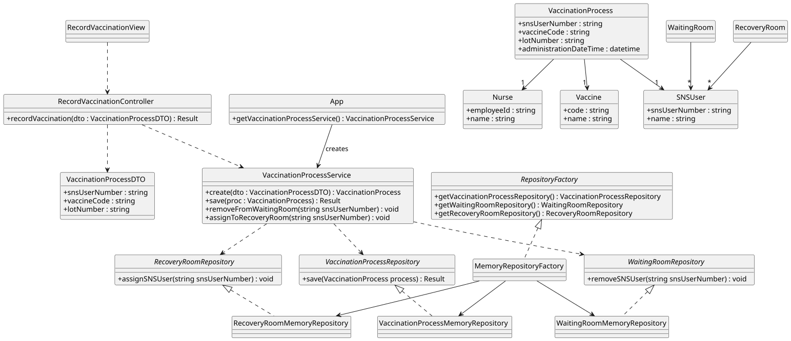

# US41 – Record vaccine administration

## 1. Requirements Engineering

### 1.1. User Story Description

As a **Nurse**, I want to record the administration of a vaccine to an SNS user so that the vaccination event is properly registered and the user can be assigned to the recovery room.  This user story belongs to sprint 4 and has high priority.

### 1.2. Customer Specifications and Clarifications

### 1.3. Acceptance Criteria

The following acceptance criteria were established for US41:

1. **AC41‑1 – Select vaccine and lot:** the nurse should select a vaccine and the administered lot number.
2. **AC41‑2 – Assign recovery room:** after recording the administration, the SNS user should be assigned to the recovery room.

### 1.4. Found out Dependencies

Recording a vaccine administration depends on previous user stories:

* **US20 – Register an SNS user:** the SNS user must exist in the system.
* **US21/US22 – Schedule and register arrival:** the SNS user must have a scheduled appointment and must have checked in to the waiting room before a nurse can record the administration.
* **US12/US11 – Vaccine management:** vaccines and their lots must be registered beforehand so that the nurse can select the correct vaccine and lot number.

In this sprint only an **in‑memory repository** is implemented; alternative persistence mechanisms can be plugged in through the abstract factory introduced for repositories.

### 1.5. Input and Output Data

**Input data:**

- **Typed data:** SNS user number, vaccine code, lot number
- **Selected data:** none

**Output data:**

- A success message confirming that the vaccine administration was recorded and the SNS user was assigned to the recovery room.

### 1.6. System Sequence Diagram (SSD)

### 1.7. Other Relevant Remarks

- Only nurses are allowed to execute this use case.  Administrators and receptionists have different responsibilities.
- The system uses an **abstract factory** to obtain repositories.  In this sprint the **MemoryRepositoryFactory** returns in‑memory implementations of the repositories, but the architecture allows alternative persistence mechanisms to be introduced seamlessly.
- All validation and business rules are performed in the **VaccinationProcessService** (a service introduced in this sprint).  Repositories merely persist data, following the separation of concerns recommended for the Service and Repository patterns.

---

## 2. OO Analysis

### 2.1. Relevant Domain Model Excerpt

### 2.2. Other Remarks

- The nurse is a specialization of **Employee**.  For brevity only the role necessary to understand this use case is shown.
- The **VaccinationProcess** encapsulates the date/time of administration, the SNS user, the nurse, the vaccine and the administered lot number.  It is persisted by the **VaccinationProcessRepository**.
- The presence of an SNS user in the waiting room or recovery room is modelled through associations with the corresponding domain entities (**WaitingRoom** and **RecoveryRoom**). These associations are updated by the service when the vaccination administration is recorded.

---

## 3. Design – User Story Realization

### 3.1. Rationale

The following table identifies which class is responsible for each step of the interaction, using GRASP patterns such as **Information Expert**, **Creator**, **Controller** and **Pure Fabrication**.

### 3.1. Rationale

| Interaction ID | Question – Which class is responsible for… | Answer | Justification (with patterns) |
|---------------|---------------------------------------------|--------|--------------------------------|
| **Step 1** | presenting the option to record a vaccine administration? | `MainView` | **Controller**: The main menu centralizes access to system functionalities and routes the nurse to the correct use case. |
| | coordinating the user story? | `RecordVaccinationController` | **Controller**: Acts as an application controller, mediating between the view and the service layer. |
| **Step 2** | requesting the SNS user number, vaccine code and lot number? | `RecordVaccinationView` | **Information Expert (IE)**: The view knows which input fields must be collected for this use case. |
| **Step 3** | typing the requested data? | `Nurse` | **Creator (Rule 1)**: In the domain model, the nurse provides the data required to register the vaccination process. |
| | building a structured object with the provided data? | `VaccinationProcessDTO` | **Low Coupling**: The DTO encapsulates all input data and prevents the view from depending directly on domain objects. |
| **Step 4** | removing the SNS user from the waiting room? | `VaccinationProcessService` | **Information Expert**: The service coordinates the vaccination workflow and manages the transition between waiting and recovery states. |
| | accessing the waiting room persistence mechanism? | `WaitingRoomRepository` | **IE**: The repository knows how SNS users are stored in the waiting room. |
| | encapsulating persistence details (memory/file/db)? | `RepositoryFactory` | **Protected Variations**: The factory hides the concrete repository implementation. |
| | showing all collected data and requesting confirmation? | `RecordVaccinationView` | **Pure Fabrication / UI**: The view is responsible for user interaction and confirmation. |
| **Step 5** | confirming the vaccination data? | `Nurse` | **Creator (Rule 1)**: In the domain model, the nurse confirms the execution of the vaccination process. |
| | creating the vaccination process domain object? | `VaccinationProcessService` | **Creator / Service**: The service has all required data and business rules to instantiate a `VaccinationProcess`. |
| | persisting the vaccination process? | `VaccinationProcessRepository` | **Information Expert**: Responsible for storing vaccination process records. |
| **Step 6** | assigning the SNS user to the recovery room? | `VaccinationProcessService` | **Information Expert**: The service coordinates post-vaccination flow and recovery room assignment. |
| | accessing recovery room persistence? | `RecoveryRoomRepository` | **IE**: The repository manages SNS users assigned to recovery rooms. |
| | informing the nurse of the operation success? | `RecordVaccinationView` | **Information Expert**: The view communicates the outcome of the operation back to the nurse. |

**Systematization**

According to the rationale the following conceptual classes are promoted to software classes:

- `VaccinationProcess`
- `VaccinationProcessService`
- `VaccinationProcessRepository` (interface)
- `RepositoryFactory` (interface)
- `MemoryRepositoryFactory` (concrete factory)
- `RecordVaccinationController`
- `RecordVaccinationView`
- `VaccinationProcessDTO`
- `WaitingRoomRepository` (interface)
- `RecoveryRoomRepository` (interface)

Other software classes identified:

- `App` – exposes the repository factory and VaccinationProcessService.
- `MainView` – integrates the new menu option.
- `VaccineRepository` and `SNSUserRepository` – existing interfaces used by the service.
- `Vaccine`, `SNSUser` and `Nurse` – existing domain classes used by the process.

### 3.2. Sequence Diagram (SD)

### 3.3. Class Diagram (CD)

---
