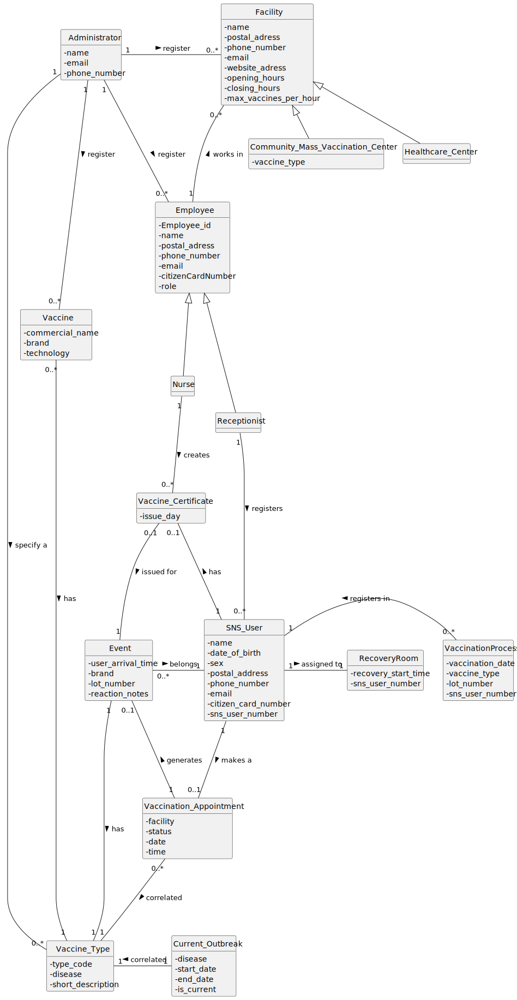

# OO Analysis

The construction process of the domain model is based on client specifications, especially the nouns (for *concepts*) and verbs (for *relations*) used.

## Rationale to identify domain conceptual classes

To identify domain conceptual classes, we start by making a list of candidate conceptual classes inspired by the categories suggested in the book *"Applying UML and Patterns: An Introduction to Object-Oriented Analysis and Design and Iterative Development."*

Sprint 2 introduces and consolidates concepts related to:

* **Vaccine type specification** (US10) – administrators create new vaccine types.
* **Vaccine registration** (US11) – administrators register new vaccine brands associated with a vaccine type and technology.
* **Employee registration** (US14) – administrators register new employees (nurses or receptionists).
* **Listing employees by role** (US15) – administrators list employees filtered by their role.

These user stories extend the domain with new concepts such as **VaccineType**, **Vaccine**, **VaccineTechnology**, **Employee**, **Role**, and their corresponding registries/containers.

Sprint 3 builds upon this foundation and introduces:

* **Listing all vaccines** (US12) – administrators obtain a list of all vaccines grouped by type and ordered alphabetically by brand.
* **Vaccination center registration** (US13) – administrators register new vaccination centres (healthcare or community mass) and associate them with vaccine types if needed.
* **SNS user registration** (US20) – receptionists register SNS users so they can schedule appointments and be vaccinated.
* **Appointment scheduling** (US30) – SNS users schedule a vaccine administration at a chosen vaccination centre and time.

Sprint 4 introduces final user stories focused on the vaccination process itself:

* **Appointment scheduling for an SNS user** (US21) – receptionists schedule a vaccine administration for an SNS user.
* **Arrival registration at a vaccination centre** (US22) – receptionists register the arrival of an SNS user and assign them to the waiting room.
* **Consult waiting room** (US40) – nurses consult the list of SNS users waiting to be vaccinated, presented on a first‑come, first‑served basis.
* **Record vaccine administration** (US41) – nurses record the administration of a vaccine to an SNS user, selecting the vaccine and lot number and assigning the user to the recovery room.

These additions introduce new concepts such as **VaccinationProcess**, **WaitingRoom**, **RecoveryRoom**, **Appointment**, and extend the existing user and centre models.

---

### *Conceptual Class Category List*

#### **Business Transactions**

* **Appointment scheduling** – creation of a vaccination appointment request made by or for an SNS user (US30/US21).
* **Vaccination process recording** – record of the administration of a vaccine dose to an SNS user, including observation and assignment to a recovery room (US41).
* **Vaccine type specification** – creation of a new vaccine type by an administrator (US10).
* **Vaccine registration** – registration of a new vaccine brand based on a defined type and technology (US11).
* **Employee registration** – registration of a new employee (nurse or receptionist) by an administrator (US14).
* **Employee listing by role** – retrieval of employees filtered by role (US15).
* **Vaccination centre registration** – registration of a new vaccination centre, either healthcare or community mass (US13).
* **SNS user registration** – registration of a new SNS user so they can schedule appointments and be vaccinated (US20).
* **List vaccines** – obtain a list of all registered vaccines grouped by type (US12).
* **Arrival registration** – registration of an SNS user’s arrival at a vaccination centre and assignment to the waiting room (US22).
* **Consult waiting room** – consultation of SNS users waiting to be vaccinated, ordered by arrival time (US40).

---

#### **Transaction Line Items**

* (No direct correspondence in the current domain.)

---

#### **Product/Service related to a Transaction or Transaction Line Item**

* **Vaccine** – biological product administered to induce immunity, associated with a vaccine type and a technology (US11).
* **Vaccine Type** – general classification of vaccines, including code, disease, and technology platform (US10).
* **Vaccine Brand** – commercial designation and manufacturer of a specific vaccine.
* **Vaccine Technology** – predefined technology platform (e.g. live‑attenuated, inactivated, subunit, toxoid, viral vector, mRNA).
* **Appointment** – time slot reserved at a vaccination centre for an SNS user (US21/US30).
* **Vaccination Process** – clinical act of administering a vaccine dose to an SNS user and monitoring them in a recovery room (US41).

---

#### **Transaction Records**

* **Vaccination Certificate** – document issued after completing the vaccination schedule.
* **Vaccination History** – collection of vaccination records for an SNS user.
* **Adverse Reaction Record** – record of observed adverse reactions during or after a vaccination.
* **Employee Record** – persistent record of an employee with identity and contact details (US14).
* **Vaccine Type Record** – persistent record describing a vaccine type (US10).
* **Vaccine Record** – persistent record describing a vaccine (US11).
* **Arrival Record** – record of an SNS user’s arrival at the vaccination centre, used to manage the waiting room (US22).
* **Waiting List Entry** – record indicating that an SNS user is waiting to be vaccinated, ordered by arrival time (US22/US40).
* **Recovery List Entry** – record indicating that an SNS user is recovering after vaccination (US41).

---

#### **Roles of People or Organizations**

* SNS User – individual with an SNS/NHS number who can schedule and receive vaccines.
* Receptionist – employee who confirms attendance and manages appointments (US14/US15).
* Nurse – employee who administers vaccines and records the vaccination process (US14/US15).
* Administrator / DGS Administrator – user who manages vaccine types, vaccines and employees (US10, US11, US14, US15).
* Employee – abstraction representing staff working in the vaccination system (specialised as Nurse and Receptionist).
* DGS – Directorate-General of Health, responsible for the vaccination programme.

---

#### **Places**

* **Vaccination Centre** – location where vaccines are administered (fixed or temporary centres). Each centre typically includes a waiting room and a recovery room (US22/US41).
* **Waiting Room** – designated area in a vaccination centre where SNS users wait to be vaccinated (US22/US40).
* **Recovery Room** – designated area in a vaccination centre where SNS users stay after receiving the vaccine to be monitored (US41).

---

#### **Noteworthy Events**

* **Appointment Created** – when an SNS user books a vaccination (US21/US30).
* **Arrival Registered** – when an SNS user arrives at a vaccination centre and is placed in the waiting room (US22).
* **Waiting Room Consulted** – when a nurse consults the list of SNS users waiting to be vaccinated, ordered by arrival time (US40).
* **Vaccination Performed** – when a vaccine dose is administered to an SNS user and recorded (US41).
* **Assigned to Recovery Room** – when an SNS user is assigned to the recovery room after vaccination (US41).
* **Adverse Reaction Observed** – when an adverse reaction is recorded during or after vaccination.
* **Vaccine Type Created** – when a new vaccine type is specified by an administrator (US10).
* **Vaccine Registered** – when a new vaccine is added to the system (US11).
* **Employee Registered** – when a new employee is created in the system (US14).
* **Employees Listed by Role** – when the system presents the list of employees filtered by a given role (US15).

---

#### **Physical Objects**

* Vaccine Dose – physical unit administered to a patient.
* Vaccine – concrete product prepared for administration.

---

#### **Descriptions of Things**

* **Vaccination Centre** – name, address, opening hours, maximum capacity, available vaccine types, and rooms (waiting and recovery) (US13).
* **Vaccine** – commercial name, brand, type code, disease target, batch (lot) number, expiration date, technology (US11/US41).
* **Vaccine Type** – unique code (ID), disease, short description, technology platform (US10).
* **Vaccine Technology** – label/identifier of the technology platform (live‑attenuated, inactivated, subunit, toxoid, viral vector, mRNA).
* **Vaccine Brand** – trade name and manufacturer.
* **SNSUser** – name, date of birth, gender, postal address, phone, email, identification numbers (SNS number, citizen card number) (US20).
* **Employee** – name, postal address, phone number, email, citizen card number, role (US14).
* **Role** – function performed by an employee (Nurse, Receptionist, Administrator).
* **Appointment** – date, time, centre, vaccine type requested, status (US21/US30).
* **Vaccination Process** – date/time, SNS user, nurse, vaccine code, lot number, recovery room assignment, observations, adverse reactions (US41).
* **Waiting Room** – ordered list of SNS users awaiting vaccination, including arrival time and current status (US22/US40).
* **Recovery Room** – list of SNS users being observed after vaccination, including start time and status (US41).
* **Vaccination Certificate** – document identifying an SNS user’s vaccines and administration dates.

---

#### **Catalogs**

* **Vaccine Type Catalog** – list of vaccine types that can be used when registering vaccines or scheduling appointments (US10).
* **Vaccine Catalog** – list of vaccines registered in the system (US11/US12).
* **Vaccination Centres Catalog** – list of active fixed and temporary vaccination centres, including their type and available vaccines (US13).
* **Employee Catalog** – list of all employees registered in the system and their roles (US14/US15).
* **SNSUser Catalog** – list of all SNS users registered in the system (US20).
* **Appointment Catalog** – list of all scheduled vaccination appointments (US21/US30).
* **Waiting Room List** – ordered list of SNS users currently waiting to be vaccinated at a given centre (US22/US40).
* **Recovery Room List** – list of SNS users currently in the recovery room after vaccination (US41).

---

#### **Containers**

* **SNSUser Registry** – collection of all SNS users (US20).
* **Personnel / Employee Registry** – collection of all employees (nurses, receptionists, administrators) (US14/US15).
* **Appointment Registry** – collection of all scheduled appointments (US21/US30).
* **Vaccine Type Container** – container responsible for storing and managing all vaccine types (US10).
* **Vaccine Container** – container responsible for storing and managing all vaccines (US11/US12).
* **Employee Container** – container responsible for storing and managing employees (US14/US15).
* **Vaccination Centre Container** – container storing and managing all vaccination centres (US13).
* **Waiting Room** – container managing the list of SNS users awaiting vaccination (US22/US40).
* **Recovery Room** – container managing the list of SNS users being observed after vaccination (US41).

---

#### **Elements of Containers**

* **Individual SNS User** – element of the SNSUser Registry (US20).
* **Individual Employee** – element of the Employee Container.
* **Individual Vaccine Type** – element of the Vaccine Type Container.
* **Individual Vaccine** – element of the Vaccine Container.
* **Individual Appointment** – element of the Appointment Registry (US21/US30).
* **Waiting Room Entry** – individual SNS user placed in the waiting room (US22/US40).
* **Recovery Room Entry** – individual SNS user in the recovery room after vaccination (US41).
* **Individual Vaccination Centre** – element of the Vaccination Centre Container (US13).

---

#### **(Other) Organizations**

* DGS – Directorate-General of Health, that defines vaccination policies and requirements.

---

#### **Other (External/Collaborating) Systems**

* SNS / NHS – national health system, where users and health information are registered.
* Adverse Reaction Reporting Systems – external systems that receive adverse reaction reports.

---

#### **Records of finance, work, contracts, legal matters**

* Not applicable in the current scope.

---

#### **Financial Instruments**

* Not applicable.

---

#### **Documents mentioned/used to perform some work**

* Vaccination Certificate – proof issued after vaccination.
* Adverse Reaction Report – document with clinical details of adverse events.
* Employee Record – internal administrative document with employee personal and contact details.

---

## Rationale to identify associations between conceptual classes

An association is a relationship between instances of objects that indicates a relevant connection that should be remembered or can be derived from common association patterns:

* ***A*** is physically or logically part of ***B***
* ***A*** is physically or logically contained in/on ***B***
* ***A*** is a description for ***B***
* ***A*** is known/logged/recorded/reported/captured in ***B***
* ***A*** uses or manages or owns ***B***
* ***A*** is related to a transaction (item) of ***B***
* etc.

The following table summarises the main associations relevant for all user stories completed so far (Sprints 2–4):

| **Concept (A)**                | **Association**                       | **Concept (B)**               |
| ------------------------------ | ------------------------------------- | ----------------------------- |
| SNS User                       | schedules                             | Appointment                   |
| SNS User                       | owns                                  | Vaccination History           |
| SNS User                       | receives vaccination at              | Vaccination Centre           |
| SNS User                       | obtains                               | Vaccination Certificate       |
| SNS User                       | assigned to                           | Waiting Room                  |
| SNS User                       | assigned to                           | Recovery Room                 |
| Receptionist                   | manages                               | Appointment                   |
| Receptionist                   | registers                             | SNS User                      |
| Receptionist                   | registers                             | Arrival                       |
| Receptionist                   | assigns                               | SNS User → Waiting Room       |
| Nurse                          | administers                           | Vaccine                       |
| Nurse                          | records                               | Vaccination Process           |
| Nurse                          | consults                              | Waiting Room                  |
| Administrator                  | manages                               | Vaccination Centre            |
| Administrator                  | manages                               | Employee                      |
| Administrator                  | creates                               | Vaccine Type                  |
| Administrator                  | registers                             | Vaccine                       |
| Administrator                  | registers                             | Employee                      |
| Administrator                  | lists                                 | Employee (by Role)            |
| Administrator                  | registers                             | Vaccination Centre            |
| Vaccination Centre             | hosts                                 | Employee                      |
| Vaccination Centre             | stores                                | Vaccine                       |
| Vaccination Centre             | contains                              | Waiting Room                  |
| Vaccination Centre             | contains                              | Recovery Room                 |
| Vaccine                        | belongs to                            | Vaccine Type                  |
| Vaccine                        | uses technology                       | Vaccine Technology            |
| Vaccine                        | produced by                           | Vaccine Brand                 |
| Appointment                    | scheduled at                          | Vaccination Centre            |
| Appointment                    | requests                              | Vaccine Type                  |
| Vaccination Process            | refers to                             | Vaccine                       |
| Vaccination Process            | administered by                      | Nurse                         |
| Vaccination Process            | pertains to                           | SNS User                      |
| Vaccination Process            | reports                               | Adverse Reaction              |
| Vaccine Type Catalog           | contains                              | Vaccine Type                  |
| Vaccine Container              | contains                              | Vaccine                       |
| Employee Container             | contains                              | Employee                      |
| Vaccination Centre Container   | contains                              | Vaccination Centre            |
| Waiting Room                   | contains                              | SNS User                      |
| Recovery Room                  | contains                              | SNS User                      |
| Employee                       | has                                   | Role                          |
| Employee                       | works at                              | Vaccination Centre            |

---

## Domain Model

The domain model across Sprints 2–4 incorporates all of the above conceptual classes and associations. It includes at least the following core concepts:

* **Actors / People**: SNS User, Administrator, Nurse, Receptionist, Employee
* **Medical domain**: Vaccine, VaccineType, VaccineBrand, VaccineTechnology, VaccinationProcess
* **Places**: Vaccination Centre (with waiting room and recovery room)
* **Scheduling**: Appointment
* **Administration / Staff management**: Employee, Role, EmployeeContainer
* **Catalogs / Containers**: VaccineTypeCatalog, VaccineContainer, EmployeeContainer, VaccinationCentreContainer, AppointmentRegistry, WaitingRoom, RecoveryRoom, SNSUserRegistry

These classes, together with their attributes and associations, are represented in the domain model diagram:

